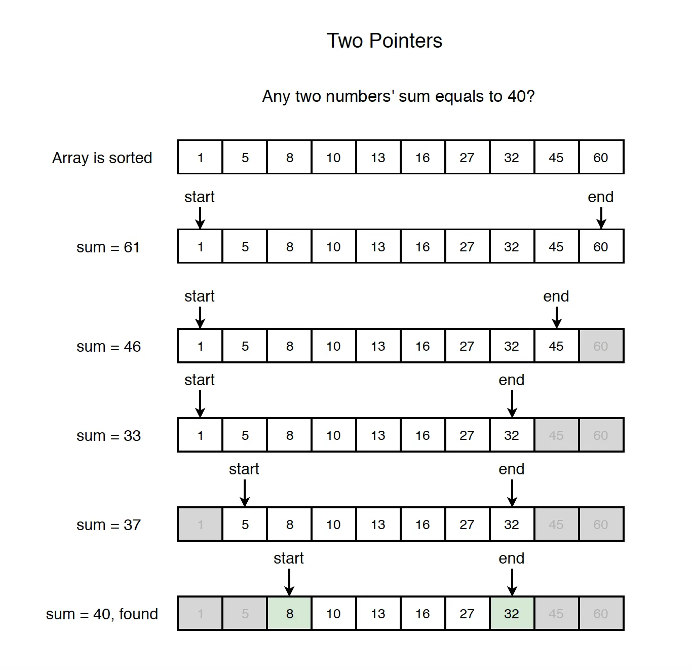
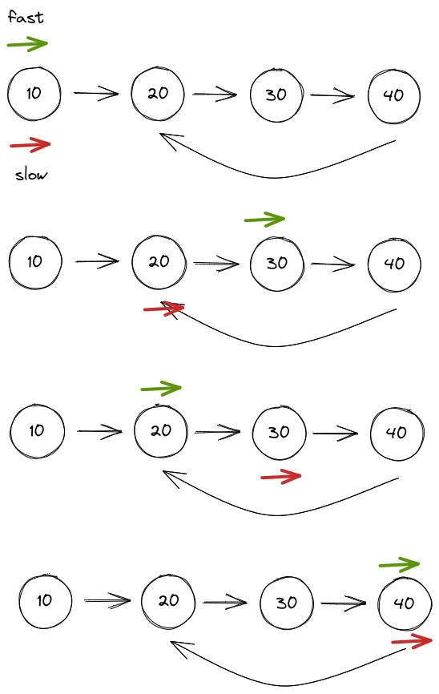

# Leetcode problems

This module should contain leetcode problems, solutions, and tests.

## Solutions
1. [Two pointers](#1-two-pointers)
2. [Fast and slow pointers](#2-fast-and-slow-pointers)

---
### 1. Two pointers

The Two-Pointers Technique is a simple yet powerful strategy where you use two indices (pointers) that traverse a data structure - such as an array, list, or string - either toward each other or in the same direction to solve problems more efficiently.

#### When to Use Two Pointers:
* <b>Sorted Input</b> : If the array or list is already sorted (or can be sorted), two pointers can efficiently find pairs or ranges. Example: Find two numbers in a sorted array that add up to a target.
* <b>Pairs or Subarrays</b> : When the problem asks about two elements, subarrays, or ranges instead of working with single elements. Example: Longest substring without repeating characters, maximum consecutive ones, checking if a string is palindrome.
* <b>Sliding Window Problems</b> : When you need to maintain a window of elements that grows/shrinks based on conditions. Example: Find smallest subarray with sum ≥ K, move all zeros to end while maintaining order.
* <b>Linked Lists (Slow–Fast pointers)</b> : Detecting cycles, finding the middle node, or checking palindrome property. Example: Floyd’s Cycle Detection Algorithm (Tortoise and Hare).

#### Complexity
Time complexity - O(n)
Memory complexity - O(1)

#### Idea
The idea of this technique is to begin with two corners of the given array. We use two index variables <b>left</b> and <b>right</b> to traverse from both corners.

Initialize: left = 0, right = n - 1

Run a loop while <b>left</b> < <b>right</b>, do the following inside the loop

* Compute current sum, <b>sum</b> = arr[left] + arr[right]
* If the <b>sum</b> equals the <b>target</b>, we’ve found the pair.
* If the <b>sum</b> is less than the <b>target</b>, move the <b>left</b> pointer to the right to increase the <b>sum</b>.
* If the <b>sum</b> is greater than the <b>target</b>, move the <b>right</b> pointer to the left to decrease the <b>sum</b>.

#### Illustration

#### How to detect it should be used

* <b>The input is sorted</b> : A sorted array or list is the clearest signal — opposite-end traversal can find pairs or validate ranges in one pass. Example: merge sorted array (#88), search insert position (#35).
* <b>"Find a pair / two elements"</b> : Any problem asking for two indices or values that satisfy a condition (sum, difference, product) is a direct match. Example: two sum (#1).
* <b>"In-place" or "O(1) extra space"</b> : When the problem forbids auxiliary data structures, two pointers let you shift, overwrite, or partition the array without allocating memory. Example: remove duplicates (#26), remove element (#27).
* <b>Comparing from both ends</b> : Problems that check symmetry or mirroring — palindromes, balanced strings — are solved by converging left and right pointers. Example: valid palindrome (#125).
* <b>Merging two sorted sequences</b> : When two sorted arrays or lists need to be combined in-place or in a single traversal, one pointer per sequence keeps the merge linear. Example: merge sorted array (#88).
* <b>Keywords to watch for</b> : "sorted", "in-place", "without extra space", "pair that sums to", "palindrome", "merge two sorted", "remove duplicates", "partition".

---
### 2. Fast and slow pointers
[Back to solutions](#Solutions)

Similar to the two pointers pattern, the fast and slow pointers pattern uses two pointers to traverse an iterable data structure, but at different speeds, often to identify cycles or find a specific target. The speeds of the pointers can be adjusted according to the problem statement. The two pointers pattern focuses on comparing data values, whereas the fast and slow pointers method is typically used to analyze the structure or properties of the data.

The key idea is that the pointers start at the same location and then start moving at different speeds. The slow pointer moves one step at a time, while the fast pointer moves by two steps. Due to the different speeds of the pointers, this pattern is also commonly known as the <b>Hare and Tortoise algorithm</b>, where the Hare is the fast pointer while Tortoise is the slow pointer. If a cycle exists, the two pointers will eventually meet during traversal. This approach enables the algorithm to detect specific properties within the data structure, such as cycles, midpoints, or intersections.

#### Illustration

#### How to detect it should be used

* <b>Input is a linked list</b> : Fast/slow pointers are the primary tool for linked-list structural problems because you can't index directly into a list and often must use O(1) space. Example: linked list cycle (#141), intersection of two linked lists (#160).
* <b>"Cycle" or "loop" in the problem title or constraints</b> : Detecting whether a cycle exists, and finding where it starts, is the textbook use case for Floyd's Tortoise and Hare algorithm. Example: linked list cycle (#141).
* <b>Finding the middle without knowing the length</b> : When the slow pointer reaches the end, the fast pointer is at the midpoint — useful before reversing the second half for a palindrome check.
* <b>Two lists of different lengths need to meet</b> : If both pointers swap to the other list's head on reaching null, they meet after exactly m + n steps regardless of individual lengths. Example: intersection of two linked lists (#160).
* <b>"Nth node from the end" or "remove kth from end"</b> : Advance the fast pointer N steps first, then move both together — when fast hits null, slow is exactly at the target.
* <b>O(1) space required on a linked list</b> : Hash-set alternatives work but use O(n) space; fast/slow pointers solve the same problems in constant space. Example: `hasCycle2` in linked list cycle (#141) shows the hash-set contrast.
* <b>Keywords to watch for</b> : "linked list", "cycle", "loop", "circular", "middle node", "intersection", "nth from end", "detect", "Floyd".

---