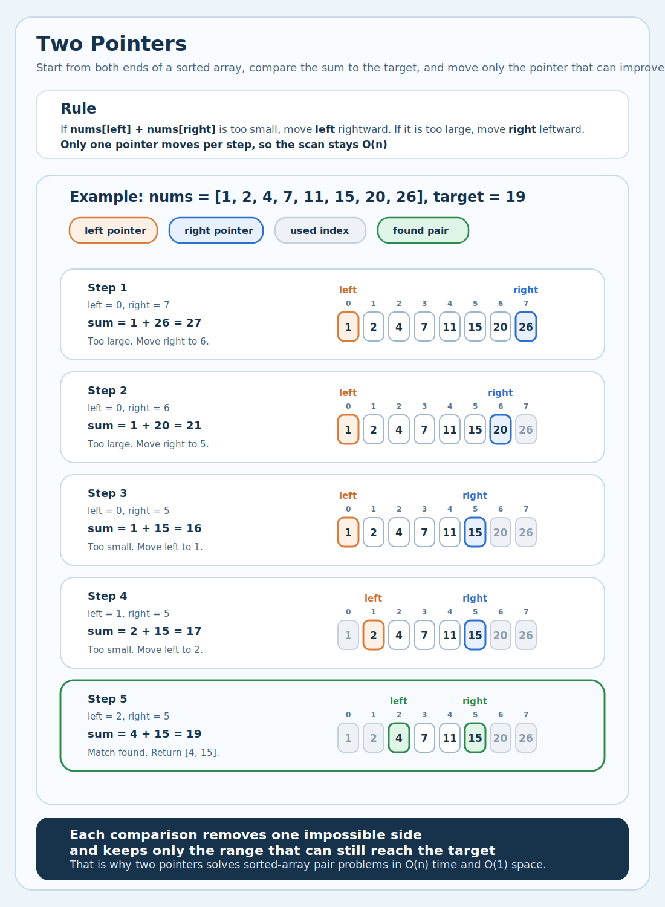
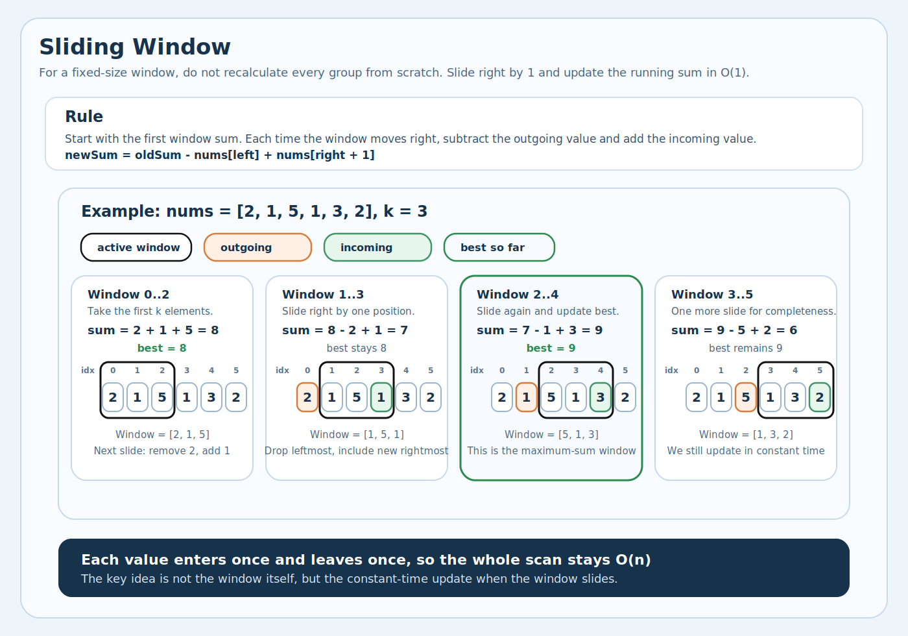
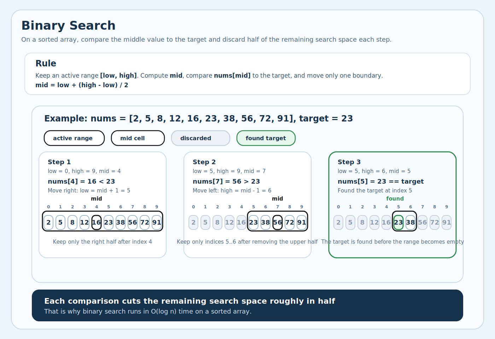
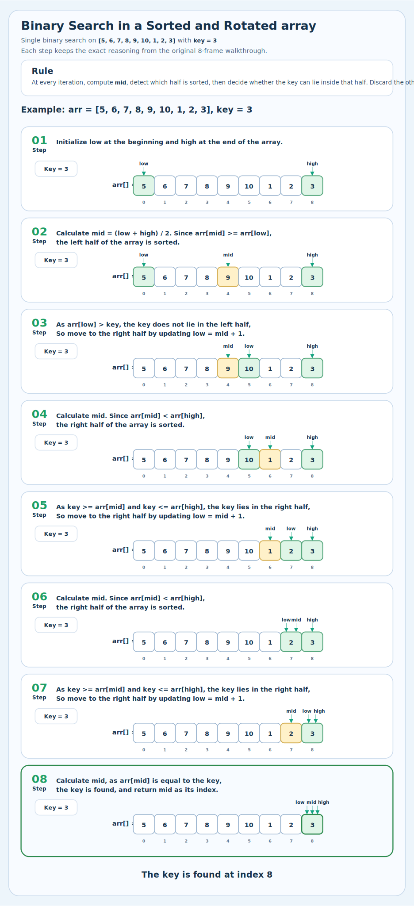
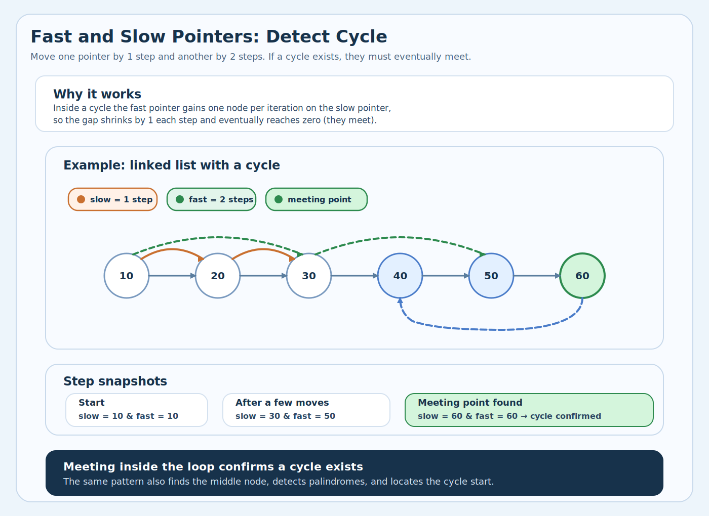
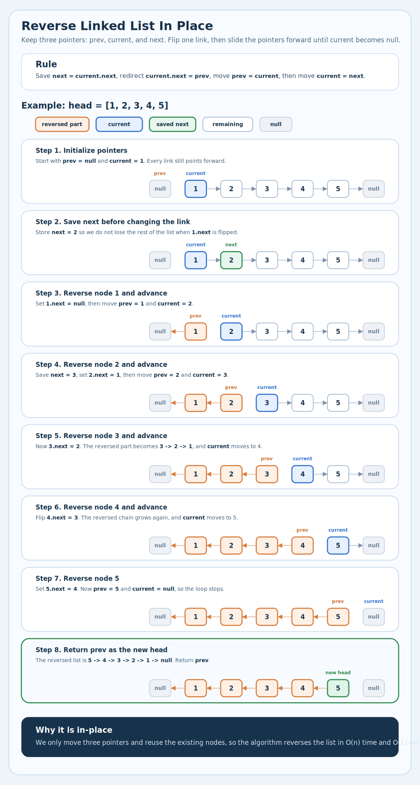
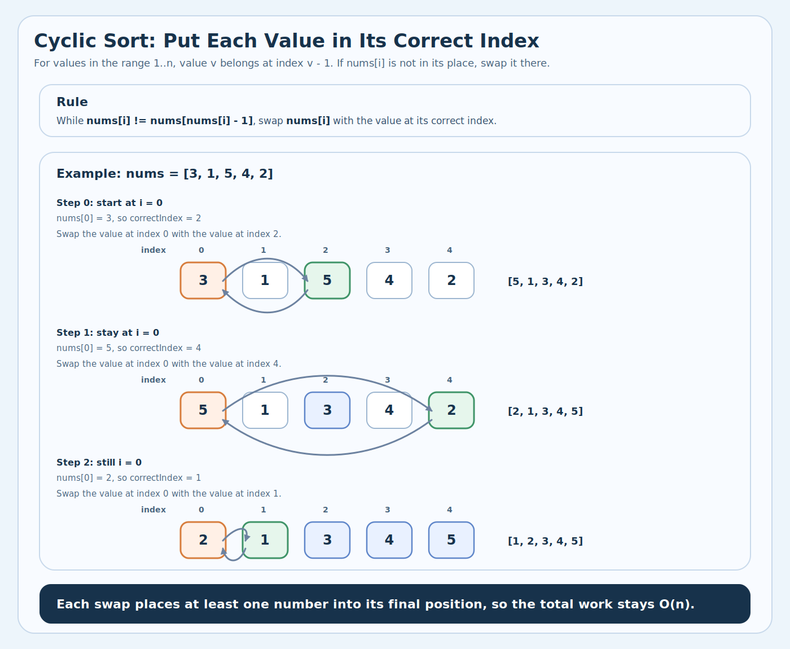

# 1. Two pointers
<sub>[Back to solutions](../README.md#solutions)</sub>

The Two-Pointers Technique is a simple yet powerful strategy where you use two indices (pointers) that traverse a data structure - such as an array, list, or string - either toward each other or in the same direction to solve problems more efficiently.

## 1.1. Idea
The idea of this technique is to begin with two corners of the given array. We use two index variables <b>left</b> and <b>right</b> to traverse from both corners.

Initialize: left = 0, right = n - 1

Run a loop while <b>left</b> < <b>right</b>, do the following inside the loop

* Compute current sum, <b>sum</b> = arr[left] + arr[right]
* If the <b>sum</b> equals the <b>target</b>, we’ve found the pair.
* If the <b>sum</b> is less than the <b>target</b>, move the <b>left</b> pointer to the right to increase the <b>sum</b>.
* If the <b>sum</b> is greater than the <b>target</b>, move the <b>right</b> pointer to the left to decrease the <b>sum</b>.

**Implementation**
```java
public int[] twoSum(int[] nums, int target) {
    int left = 0;
    int right = nums.length - 1;

    while (left < right) {
        int sum = nums[left] + nums[right];

        if (sum == target) {
            return new int[]{left, right};
        } else if (sum < target) {
            left++;
        } else {
            right--;
        }
    }

    return new int[]{};
}
```

## 1.2. Illustration



## 1.3. Complexity

**Time complexity:** `O(n)`  
**Space complexity:** `O(1)`

## 1.4. How to detect it should be used

Key signals that Two Pointers is the right approach:

1) <b>Sorted array/list</b> — problem involves a sorted collection and asks for pairs/triplets satisfying a condition.
2) <b>Find a pair with target sum</b> — two sum in a sorted array, 3Sum, 4Sum.
3) <b>Remove duplicates in-place</b> — one pointer reads, one writes.
4) <b>Partition / rearrange in-place</b> — move zeroes, sort colors (Dutch flag), separate odds/evens.
5) <b>Palindrome check</b> — compare from both ends moving inward.
6) <b>Merge two sorted arrays/lists</b> — one pointer per collection.
7) <b>Container with most water</b> / <b>trapping rain water</b> — shrink from both ends based on a condition.
8) <b>Subsequence check</b> — is string s a subsequence of string t?

## 1.5. LeetCode problems

**Easy**
* https://leetcode.com/problems/remove-duplicates-from-sorted-array/
* https://leetcode.com/problems/remove-element/
* https://leetcode.com/problems/merge-sorted-array/
* https://leetcode.com/problems/valid-palindrome/
* https://leetcode.com/problems/linked-list-cycle/
* https://leetcode.com/problems/intersection-of-two-linked-lists/
* https://leetcode.com/problems/happy-number/
* https://leetcode.com/problems/palindrome-linked-list/
* https://leetcode.com/problems/move-zeroes/
* https://leetcode.com/problems/reverse-string/
* https://leetcode.com/problems/reverse-vowels-of-a-string/
* https://leetcode.com/problems/is-subsequence/
* https://leetcode.com/problems/assign-cookies/
* https://leetcode.com/problems/valid-palindrome-ii/
* https://leetcode.com/problems/backspace-string-compare/
* https://leetcode.com/problems/middle-of-the-linked-list/
* https://leetcode.com/problems/squares-of-a-sorted-array/
* https://leetcode.com/problems/duplicate-zeros/
* https://leetcode.com/problems/check-if-n-and-its-double-exist/
* https://leetcode.com/problems/merge-strings-alternately/
* https://leetcode.com/problems/minimum-common-value/
* https://leetcode.com/problems/count-pairs-whose-sum-is-less-than-target/

**Medium**
* https://leetcode.com/problems/container-with-most-water/
* https://leetcode.com/problems/3sum/
* https://leetcode.com/problems/3sum-closest/
* https://leetcode.com/problems/4sum/
* https://leetcode.com/problems/remove-nth-node-from-end-of-list/
* https://leetcode.com/problems/next-permutation/
* https://leetcode.com/problems/sort-colors/
* https://leetcode.com/problems/remove-duplicates-from-sorted-array-ii/
* https://leetcode.com/problems/reorder-list/
* https://leetcode.com/problems/compare-version-numbers/
* https://leetcode.com/problems/two-sum-ii-input-array-is-sorted/
* https://leetcode.com/problems/rotate-array/
* https://leetcode.com/problems/find-the-duplicate-number/
* https://leetcode.com/problems/string-compression/
* https://leetcode.com/problems/longest-word-in-dictionary-through-deleting/
* https://leetcode.com/problems/permutation-in-string/
* https://leetcode.com/problems/valid-triangle-number/
* https://leetcode.com/problems/find-k-closest-elements/
* https://leetcode.com/problems/swap-adjacent-in-lr-string/
* https://leetcode.com/problems/boats-to-save-people/
* https://leetcode.com/problems/interval-list-intersections/
* https://leetcode.com/problems/number-of-subsequences-that-satisfy-the-given-sum-condition/
* https://leetcode.com/problems/shortest-subarray-to-be-removed-to-make-array-sorted/
* https://leetcode.com/problems/max-number-of-k-sum-pairs/
* https://leetcode.com/problems/minimum-length-of-string-after-deleting-similar-ends/
* https://leetcode.com/problems/maximum-distance-between-a-pair-of-values/
* https://leetcode.com/problems/maximum-twin-sum-of-a-linked-list/
* https://leetcode.com/problems/successful-pairs-of-spells-and-potions/

**Hard**
* https://leetcode.com/problems/trapping-rain-water/
* https://leetcode.com/problems/find-k-th-smallest-pair-distance/
* https://leetcode.com/problems/longest-chunked-palindrome-decomposition/
* https://leetcode.com/problems/last-substring-in-lexicographical-order/
* https://leetcode.com/problems/get-the-maximum-score/
* https://leetcode.com/problems/closest-subsequence-sum/

---

# 2. Sliding Window
<sub>[Back to solutions](../README.md#solutions)</sub>

Imagine you have a tray of 10 cookies and want to find the most chocolate chips in any 3 cookies next to each other. Using a naive approach, you’d stand at each cookie and count its chocolate chips along with those of its immediate left and right neighbors to form every possible group of 3. This means repeating the counting process for each cookie, which quickly becomes inefficient as the number of cookies grows.

## 2.1. Idea

We can avoid this hassle by using a smarter approach. Instead of recounting the chips for each group from scratch, you start by counting the chips in the first 3 cookies. Then, as you move to the next group, you simply subtract the chips from the cookie you leave behind and add the chips from the new cookie you include.

Consider the following steps:

1. Count the chips in the first three cookies. This is your starting total—and your initial “best so far.”
2. Slide the window one cookie to the right:
    1. Subtract the chips from the cookie that just slipped out of the window.
    2. Add the chips from the fresh cookie that slid into view.
3. If this new sum tops your current record, replace it with the initial “best so far”.
4. Repeat the above steps for each group of three cookies, all the way to the last one.

By updating the total in constant time with each slide, you find the group of neighboring cookies with maximum chocolate chips without ever recounting the entire window—a perfect illustration of the sliding-window technique.

### 2.1.1. Fixed Size Window

```java
public int maxSumSubarray(int[] nums, int k) {
    int windowSum = 0;
    int maxSum = Integer.MIN_VALUE;

    for (int i = 0; i < nums.length; i++) {
        windowSum += nums[i];              // expand window

        if (i >= k - 1) {
            maxSum = Math.max(maxSum, windowSum);
            windowSum -= nums[i - (k - 1)]; // shrink window
        }
    }

    return maxSum;
}
```

### 2.1.2. Variable Size Window (Smallest subarray with sum >= target)

```java
public int minSubArrayLen(int target, int[] nums) {
    int left = 0;
    int windowSum = 0;
    int minLength = Integer.MAX_VALUE;

    for (int right = 0; right < nums.length; right++) {
        windowSum += nums[right];              // expand

        while (windowSum >= target) {          // shrink while valid
            minLength = Math.min(minLength, right - left + 1);
            windowSum -= nums[left];
            left++;
        }
    }

    return minLength == Integer.MAX_VALUE ? 0 : minLength;
}
```

### 2.1.3. Window with HashMap (Longest substring without repeating chars)

```java
public int lengthOfLongestSubstring(String s) {
   Map<Character, Integer> lastSeen = new HashMap<>();
   int left = 0;
   int maxLength = 0;

   for (int right = 0; right < s.length(); right++) {
      char c = s.charAt(right);

      if (lastSeen.containsKey(c) && lastSeen.get(c) >= left) {
         left = lastSeen.get(c) + 1;   // jump left past duplicate
      }

      lastSeen.put(c, right);
      maxLength = Math.max(maxLength, right - left + 1);
   }

   return maxLength;
}
```

## 2.2. Illustration



## 2.3. Complexity

**Time complexity:** `O(n)`  
**Space complexity:** `O(1)` or `O(k)`

### 2.3.1. Why O(n) time:

Each element is touched at most twice — once when the right pointer expands the window over it, and once when the left pointer shrinks past it. Despite looking like a nested loop, the total pointer movements across the entire run is bounded by 2n → `O(n)`.

### 2.3.2. Why the space depends on window type:

There are two variants:

* Fixed-size window (like the cookie example in the README) — only a running sum and a max variable are needed → `O(1)` space
* Dynamic/variable window — the window grows and shrinks based on a condition (e.g. "longest substring without repeating characters"), which typically requires a HashMap or HashSet to track what's currently inside the window → `O(k)` space, where k is the number of distinct elements in the window (≤ alphabet size, so often treated as `O(1)` for fixed alphabets, or `O(n)` worst case for arbitrary inputs)

## 2.4. How to detect it should be used

Key signals that Sliding Window is the right approach:

1) <b>Subarray / substring</b> — problem involves a contiguous sequence of elements.
2) <b>Maximum / minimum of size K</b> — find best subarray of a fixed length.
3) <b>Longest / shortest with constraint</b> — find variable-size window satisfying a condition.
4) <b>At most K distinct</b> — limit on diversity inside the window.
5) <b>Contains all characters of</b> — minimum window covering required elements.
6) <b>Consecutive</b> — contiguous elements satisfying a property.
7) <b>Anagram / permutation in string</b> — fixed-size frequency match.

## 2.5. LeetCode problems

**Easy**
* https://leetcode.com/problems/contains-duplicate-ii/ 
* https://leetcode.com/problems/longest-harmonious-subsequence/
* https://leetcode.com/problems/maximum-average-subarray-i/
* https://leetcode.com/problems/defuse-the-bomb/
* https://leetcode.com/problems/substrings-of-size-three-with-distinct-characters/
* https://leetcode.com/problems/minimum-difference-between-highest-and-lowest-of-k-scores/
* https://leetcode.com/problems/find-the-k-beauty-of-a-number/
* https://leetcode.com/problems/minimum-recolors-to-get-k-consecutive-black-blocks/

**Medium**
* https://leetcode.com/problems/longest-substring-without-repeating-characters/ 
* https://leetcode.com/problems/repeated-dna-sequences/
* https://leetcode.com/problems/minimum-size-subarray-sum/
* https://leetcode.com/problems/longest-repeating-character-replacement/
* https://leetcode.com/problems/find-all-anagrams-in-a-string/
* https://leetcode.com/problems/permutation-in-string/
* https://leetcode.com/problems/subarray-product-less-than-k/
* https://leetcode.com/problems/fruit-into-baskets/
* https://leetcode.com/problems/binary-subarrays-with-sum/
* https://leetcode.com/problems/max-consecutive-ones-iii/
* https://leetcode.com/problems/grumpy-bookstore-owner/
* https://leetcode.com/problems/get-equal-substrings-within-budget/
* https://leetcode.com/problems/replace-the-substring-for-balanced-string/
* https://leetcode.com/problems/count-number-of-nice-subarrays/
* https://leetcode.com/problems/number-of-sub-arrays-of-size-k-and-average-greater-than-or-equal-to-threshold/
* https://leetcode.com/problems/number-of-substrings-containing-all-three-characters/
* https://leetcode.com/problems/maximum-points-you-can-obtain-from-cards/
* https://leetcode.com/problems/longest-continuous-subarray-with-absolute-diff-less-than-or-equal-to-limit/
* https://leetcode.com/problems/maximum-number-of-vowels-in-a-substring-of-given-length/
* https://leetcode.com/problems/longest-subarray-of-1s-after-deleting-one-element/
* https://leetcode.com/problems/minimum-operations-to-reduce-x-to-zero/
* https://leetcode.com/problems/maximum-erasure-value/
* https://leetcode.com/problems/frequency-of-the-most-frequent-element/
* https://leetcode.com/problems/minimum-number-of-flips-to-make-the-binary-string-alternating/
* https://leetcode.com/problems/maximize-the-confusion-of-an-exam/
* https://leetcode.com/problems/minimum-consecutive-cards-to-pick-up/
* https://leetcode.com/problems/longest-nice-subarray/
* https://leetcode.com/problems/maximum-sum-of-distinct-subarrays-with-length-k/
* https://leetcode.com/problems/count-the-number-of-good-subarrays/
* https://leetcode.com/problems/find-the-longest-semi-repetitive-substring/

**Hard**
* https://leetcode.com/problems/substring-with-concatenation-of-all-words/
* https://leetcode.com/problems/minimum-window-substring/
* https://leetcode.com/problems/contains-duplicate-iii/
* https://leetcode.com/problems/sliding-window-maximum/
* https://leetcode.com/problems/sliding-window-median/
* https://leetcode.com/problems/maximum-sum-of-3-non-overlapping-subarrays/
* https://leetcode.com/problems/shortest-subarray-with-sum-at-least-k/
* https://leetcode.com/problems/subarrays-with-k-different-integers/
* https://leetcode.com/problems/minimum-number-of-k-consecutive-bit-flips/
* https://leetcode.com/problems/longest-duplicate-substring/
* https://leetcode.com/problems/constrained-subsequence-sum/
* https://leetcode.com/problems/max-value-of-equation/
* https://leetcode.com/problems/minimum-adjacent-swaps-for-k-consecutive-ones/
* https://leetcode.com/problems/minimum-number-of-operations-to-make-array-continuous/
* https://leetcode.com/problems/count-subarrays-with-score-less-than-k/
* https://leetcode.com/problems/maximum-number-of-robots-within-budget/
* https://leetcode.com/problems/count-subarrays-with-fixed-bounds/
* https://leetcode.com/problems/maximize-the-minimum-powered-city/

---

# 3. Modified Binary search
<sub>[Back to solutions](../README.md#solutions)</sub>

[Rotated Array](#32-rotated-array)

## 3.1. Binary Search

Binary Search is the most popular Searching Algorithm which is most asked in coding interviews. Its popularity is because of it’s time complexity, where the linear search algorithm takes `O(N)` time, the Binary Search takes `O(log N)` time. The only condition in Binary Search is that the array should be sorted.

### 3.1.1. Idea

The reason why Binary Search provides `O(log N)` time complexity is that on each iteration it eliminates half of the array and searches the element in the remaining half.

**Implementation**
```java
public int binarySearch(int[] nums, int target) {
    int left = 0;
    int right = nums.length - 1;

    while (left <= right) {
        int mid = left + (right - left) / 2;  // avoid overflow

        if (nums[mid] == target) {
            return mid;
        } else if (nums[mid] < target) {
            left = mid + 1;
        } else {
            right = mid - 1;
        }
    }

    return -1;
}
```

### 3.1.2. Illustration



### 3.1.3. Complexity

**Iterative algorithm**
- **Time complexity:** `O(log n)`
- **Space complexity:** `O(1)`

**Recursive algorithm**
- **Time complexity:** `O(log n)`
- **Space complexity:** `O(log n)`

### 3.1.4. How to detect it should be used

Key signals that Binary Search is the right approach:

1) <b>Sorted array/matrix</b> — input is sorted or partially sorted.
2) <b>Find target / position / index</b> — locate an element in sorted data.
3) <b>First / last occurrence</b> — find boundary of duplicates.
4) <b>Minimum / maximum that satisfies condition</b> — search on answer space.
5) <b>Rotated sorted array</b> — half is always sorted, binary search still works.
6) <b>O(log n) required</b> — problem explicitly demands logarithmic time.
7) <b>Find peak / valley</b> — monotonic property on both sides.
8) <b>Can you achieve X with capacity/speed/value Y?</b> — yes/no boundary in a range.

### 3.1.5. LeetCode problems

**Easy**
* https://leetcode.com/problems/search-insert-position/
* https://leetcode.com/problems/first-bad-version/
* https://leetcode.com/problems/guess-number-higher-or-lower/
* https://leetcode.com/problems/binary-search/
* https://leetcode.com/problems/find-smallest-letter-greater-than-target/

**Medium**
* https://leetcode.com/problems/find-first-and-last-position-of-element-in-sorted-array/
* https://leetcode.com/problems/search-a-2d-matrix/

## 3.2. Rotated array
<sub>[Back to solutions](../README.md#solutions)</sub><br/>
<sub>[Back to Modified Binary search](#3-modified-binary-search)</sub>

### 3.2.1. Idea

```text
Suppose an array sorted in ascending order is rotated at some pivot unknown to you beforehand.
(i.e.,  [0,1,2,4,5,6,7] might become  [4,5,6,7,0,1,2]).

Find the minimum element.

Input: [3,4,5,1,2]
Output: 1
```

#### 3.2.1.1. Problem solution

Let us look at this rotated array example carefully:

```text
Example: [4,5,6,7,0,1,2] // minimum element 0 at index 5
```

By observing the array we can conclude two points:

1. The index of the minimum element is the same as the number of rotations of the array
2. The minimum element is smaller than its adjacents

But How do we eliminate one half of the array through Binary Search?

The approach is similar to the standard binary search where we find the middle element of the array but the condition changes. Hence by modifying the standard Binary Search Algorithm we get the solution.

When we find the middle element ( in the above example number 7 is the middle element ) we can observe that the array is divided into two halves where one half is sorted and the other half is unsorted. Another interesting observation is that the minimum element is always in the unsorted half.

#### 3.2.1.2. Algorithm

1. Find the middle element of the array.
2. Check if the middle element is the minimum element
3. If the middle element does not satisfy the minimum element condition then apply binary search on the unsorted half of the array.

### 3.2.2. Illustration



### 3.2.4. How to detect it should be used

Key signals that Rotated Array is the right approach:

1) <b>Sorted and rotated</b> — explicitly stated in the problem.
2) <b>Shifted / pivoted array</b> — array was sorted then rotated at some pivot.
3) <b>Find minimum in rotated</b> — locate the rotation point.
4) <b>Search in rotated</b> — find a target in a rotated sorted array.
5) <b>Find pivot / inflection point</b> — where the order breaks.

### 3.2.5. LeetCode problems

**Easy**
* https://leetcode.com/problems/rotate-array/
* https://leetcode.com/problems/check-if-array-is-sorted-and-rotated/

**Medium**
* https://leetcode.com/problems/search-in-rotated-sorted-array/
* https://leetcode.com/problems/search-in-rotated-sorted-array-ii/
* https://leetcode.com/problems/find-minimum-in-rotated-sorted-array/

**Hard**
* https://leetcode.com/problems/find-minimum-in-rotated-sorted-array-ii/

---

# 4. Fast and slow pointers
<sub>[Back to solutions](../README.md#solutions)</sub>

Similar to the two pointers pattern, the fast and slow pointers pattern uses two pointers to traverse an iterable data structure, but at different speeds, often to identify cycles or find a specific target. The speeds of the pointers can be adjusted according to the problem statement. The two pointers pattern focuses on comparing data values, whereas the fast and slow pointers method is typically used to analyze the structure or properties of the data.

## 4.1. Idea

The key idea is that the pointers start at the same location and then start moving at different speeds. The slow pointer moves one step at a time, while the fast pointer moves by two steps. Due to the different speeds of the pointers, this pattern is also commonly known as the <b>Hare and Tortoise algorithm</b>, where the Hare is the fast pointer while Tortoise is the slow pointer. If a cycle exists, the two pointers will eventually meet during traversal. This approach enables the algorithm to detect specific properties within the data structure, such as cycles, midpoints, or intersections.

### 4.1.1. Detect Cycle

```java
public boolean hasCycle(ListNode head) {
    ListNode slow = head;
    ListNode fast = head;

    while (fast != null && fast.next != null) {
        slow = slow.next;           // 1 step
        fast = fast.next.next;      // 2 steps

        if (slow == fast) {
            return true;            // they met → cycle exists
        }
    }

    return false;                   // fast reached end → no cycle
}
```

```text
No cycle:   1 → 2 → 3 → 4 → null
            s
            f
            
            1 → 2 → 3 → 4 → null
                s   f

            1 → 2 → 3 → 4 → null
                    s           f (null) → no cycle

Cycle:      1 → 2 → 3 → 4
                ↑       |
                └───────┘
            
            slow: 1 → 2 → 3 → 4 → 2 → 3
            fast: 1 → 3 → 2 → 4 → 3
                                  ↑   ↑
                                  slow=fast → cycle!
```

### 4.1.2. Find Cycle Start

```java
public ListNode detectCycleStart(ListNode head) {
    ListNode slow = head;
    ListNode fast = head;

    // 1. detect cycle
    while (fast != null && fast.next != null) {
        slow = slow.next;
        fast = fast.next.next;

        if (slow == fast) {
            // 2. find cycle start
            ListNode start = head;
            while (start != slow) {
                start = start.next;     // 1 step from head
                slow = slow.next;       // 1 step from meeting point
            }
            return start;               // they meet at cycle start
        }
    }

    return null;
}
```

```text
    head              cycle start
      ↓               ↓
      1 → 2 → 3 → 4 → 5 → 6 → 7 → 8
                      ↑           |
                      └───────────┘
      |←───── a ─────→|←─ b ─→|
      
      Meeting point is b steps into the cycle.
      Distance from head to cycle start = a
      Distance from meeting point to cycle start = a  (math works out)
      
      So move one pointer from HEAD, one from MEETING POINT,
      both at speed 1 → they meet at CYCLE START.

```

### 4.1.3. Find Middle of Linked List

```java
public ListNode findMiddle(ListNode head) {
    ListNode slow = head;
    ListNode fast = head;

    while (fast != null && fast.next != null) {
        slow = slow.next;
        fast = fast.next.next;
    }

    return slow;   // slow is at the middle
}
```

```text
Odd:   1 → 2 → 3 → 4 → 5
       s       
       f

       1 → 2 → 3 → 4 → 5
               s       
                       f

       1 → 2 → 3 → 4 → 5
               ↑
             middle (3)

Even:  1 → 2 → 3 → 4
       s       
       f

       1 → 2 → 3 → 4
               s       
                       f (null)
               ↑
         middle (3, second of two)
```

### 4.1.4. Palindrome Linked List

```java
public boolean isPalindrome(ListNode head) {
    // 1. find middle
    ListNode slow = head;
    ListNode fast = head;
    while (fast != null && fast.next != null) {
        slow = slow.next;
        fast = fast.next.next;
    }

    // 2. reverse second half
    ListNode prev = null;
    while (slow != null) {
        ListNode next = slow.next;
        slow.next = prev;
        prev = slow;
        slow = next;
    }

    // 3. compare both halves
    ListNode left = head;
    ListNode right = prev;
    while (right != null) {
        if (left.val != right.val) return false;
        left = left.next;
        right = right.next;
    }

    return true;
}
```

```text
Input:  1 → 2 → 3 → 2 → 1

Step 1 - find middle:       3
Step 2 - reverse 2nd half:  1 → 2 → 3   1 → 2
Step 3 - compare:           1==1 ✓  2==2 ✓  → palindrome
```

### 4.1.5. Happy Number

```java
public boolean isHappy(int n) {
    int slow = n;
    int fast = n;

    do {
        slow = sumOfSquares(slow);                  // 1 step
        fast = sumOfSquares(sumOfSquares(fast));     // 2 steps
    } while (slow != fast);

    return slow == 1;   // if cycle lands on 1 → happy
}

private int sumOfSquares(int n) {
    int sum = 0;
    while (n > 0) {
        int digit = n % 10;
        sum += digit * digit;
        n /= 10;
    }
    return sum;
}
```

```text
Happy (19):     19 → 82 → 68 → 100 → 1 → 1 → 1  (cycle at 1 ✓)
Not happy (2):  2 → 4 → 16 → 37 → 58 → 89 → 145 → 42 → 20 → 4  (cycle not at 1)
```

## 4.2. Illustration



## 4.3. Complexity

**Time complexity:** `O(n)`  
**Space complexity:** `O(1)`

### 4.3.1. Why `O(n)` time:

* No cycle — the fast pointer hits null after traversing at most n nodes (it skips every other node, so at most n/2 steps, still `O(n)`)<br/>
* Cycle exists — once both pointers are inside the cycle, the fast pointer gains one step on the slow pointer per iteration. The cycle length is at most n, so they meet within n more steps → still `O(n)` total<br/>
* Finding the middle — fast reaches the end after n/2 steps → `O(n)`<br/>
* Intersection of two lists — each pointer walks at most m + n nodes before meeting → `O(m + n)`

### 4.3.2. Why O(1) space:

Only two pointer variables (slow, fast) are maintained regardless of list size. No auxiliary data structure (array, set, map) is ever allocated. This is the key advantage over the hash-set alternative — for example, hasCycle2 in LinkedListCycle.java solves the same problem in `O(n)` space by storing visited nodes in a HashSet.

## 4.4. How to detect it should be used

Key signals that Fast and Slow Pointers is the right approach:

1) <b>Cycle in linked list</b> — detect if a loop exists.
2) <b>Find cycle start</b> — locate where the cycle begins.
3) <b>Middle of linked list</b> — find the center node.
4) <b>Palindrome linked list</b> — need to compare first half with reversed second half.
5) <b>Happy number</b> — detect cycle in a number sequence.
6) <b>O(1) space</b> + linked list — can't use extra data structures.
7) <b>Nth from end</b> — find a node relative to the tail.

## 4.5. LeetCode problems

**Easy**
* https://leetcode.com/problems/linked-list-cycle/
* https://leetcode.com/problems/happy-number/
* https://leetcode.com/problems/palindrome-linked-list/
* https://leetcode.com/problems/middle-of-the-linked-list/

**Medium**
* https://leetcode.com/problems/remove-nth-node-from-end-of-list/
* https://leetcode.com/problems/linked-list-cycle-ii/
* https://leetcode.com/problems/reorder-list/
* https://leetcode.com/problems/find-the-duplicate-number/
* https://leetcode.com/problems/circular-array-loop/

---

# 5. In-Place Reversal of a Linked List
<sub>[Back to solutions](../README.md#solutions)</sub>

In-place refers to an algorithm that processes or modifies a data structure using only the existing memory space, without requiring additional memory proportional to the input size.

## 5.1. Idea

The in-place reversal algorithm for a singly linked list follows these key steps:

1. Initialize three pointers: prev as NULL, current as the head of the list, and next as NULL.
2. Iterate through the list until current becomes NULL:
3. Store the next node: next = current.next
4. Reverse the current node’s pointer: current.next = prev
5. Move prev and current one step forward:
    * prev = current
    * current = next
6. Set the new head of the reversed list to prev.

This algorithm effectively reverses the direction of each link in the list, thereby reversing the entire list.

**Implementation**
```java
import java.util.ArrayList;
import java.util.List;

class ListNode {
    int val;
    ListNode next;

    ListNode(int val) {
        this.val = val;
    }
}

public class ReverseLinkedListExample {

    static ListNode reverseLinkedList(ListNode head) {
        ListNode prev = null;
        ListNode current = head;

        while (current != null) {
            ListNode next = current.next;
            current.next = prev;
            prev = current;
            current = next;
        }

        return prev; // prev is now the new head
    }

    static ListNode createLinkedList(int[] values) {
        ListNode dummy = new ListNode(0);
        ListNode current = dummy;
        for (int value : values) {
            current.next = new ListNode(value);
            current = current.next;
        }
        return dummy.next;
    }

    static List<Integer> linkedListToList(ListNode head) {
        List<Integer> result = new ArrayList<>();
        ListNode current = head;
        while (current != null) {
            result.add(current.val);
            current = current.next;
        }
        return result;
    }

    public static void main(String[] args) {
        ListNode originalList = createLinkedList(new int[]{1, 2, 3, 4, 5});
        ListNode reversedList = reverseLinkedList(originalList);

        System.out.println("Reversed list: " + linkedListToList(reversedList));
    }
}
```

## 5.2. Illustration



## 5.3. Complexity

**Time complexity:** `O(n)`  
**Space complexity:** `O(1)`

### 5.3.1. Why `O(n)` time:
`n` is the number of nodes in the linked list. Since we traverse the list once and do `O(1)` work per node, the total time is `O(n)`.

### 5.3.1. Why `O(1)` space:
We only use a fixed number of pointers (prev, current, and next) regardless of the size of the input list. This is what makes the algorithm “in-place” – it doesn’t require additional space proportional to the input size.

This combination of linear time complexity and constant space complexity makes the in-place reversal algorithm highly efficient and desirable in many scenarios, especially when dealing with large lists or in memory-constrained environments.

## 5.4. How to detect it should be used
Key signals that In-Place Reversal is the right approach:

1) <b>Reverse a linked list</b> — fully or partially (reverse between positions m and n).
2) <b>Reverse in groups of K</b> — reverse nodes in k-group, swap pairs.
3) <b>Palindrome linked list</b> — reverse the second half, then compare.
4) <b>Reorder list</b> — interleave first half with reversed second half.
5) <b>Rotate list</b> — rearranging node order without extra space.
6) O(1) space constraint — cannot use extra data structures, must modify pointers in place.

## 5.5. LeetCode problems

**Easy**
* https://leetcode.com/problems/reverse-linked-list/

**Medium**
* https://leetcode.com/problems/swap-nodes-in-pairs/
* https://leetcode.com/problems/rotate-list/
* https://leetcode.com/problems/reverse-linked-list-ii/
* https://leetcode.com/problems/reorder-list/
* https://leetcode.com/problems/odd-even-linked-list/

**Hard**
* https://leetcode.com/problems/reverse-nodes-in-k-group/

---

# 6. Cyclic Sort
<sub>[Back to solutions](../README.md#solutions)</sub>

## 6.1. Idea

Suppose there is an array arr which has n <b>distinct</b> elements. Given an element A, we can find its index by counting the number of elements smaller than A.

1. If the element is at its correct position, simply leave it as it is.
2. Otherwise, we have to find the correct position of A by counting the number of elements that are smaller. Another element B is replaced to be moved to its correct position. This process continues until we get an element at the original position of A.

## 6.2. Illustration



## 6.3. Complexity

**Time complexity:** `O(n)`  
Even though some indices may be revisited after swaps, each number is moved to its correct position at most once, so the total work is linear.

**Space complexity:** `O(1)`

Cycle Sort isn’t a stable sorting algorithm

## 6.4. How to detect it should be used

Use cyclic sort when:
1. Array size is n.
2. Values are supposed to belong to a tight index-like range: 1..n or 0..n-1.
3. Task is about placement-based facts, not full sorting:
   * missing number(s)
   * duplicate(s)
   * corrupt pair
   * first missing positive (variant)
4. Constraints ask for `O(n)` time and `O(1)` extra space.

## 6.5. LeetCode problems

**Easy**
* https://leetcode.com/problems/missing-number/
* https://leetcode.com/problems/find-all-numbers-disappeared-in-an-array/
* https://leetcode.com/problems/set-mismatch/

**Medium**
* https://leetcode.com/problems/find-the-duplicate-number/
* https://leetcode.com/problems/find-all-duplicates-in-an-array/

**Hard**
* https://leetcode.com/problems/first-missing-positive/


---
