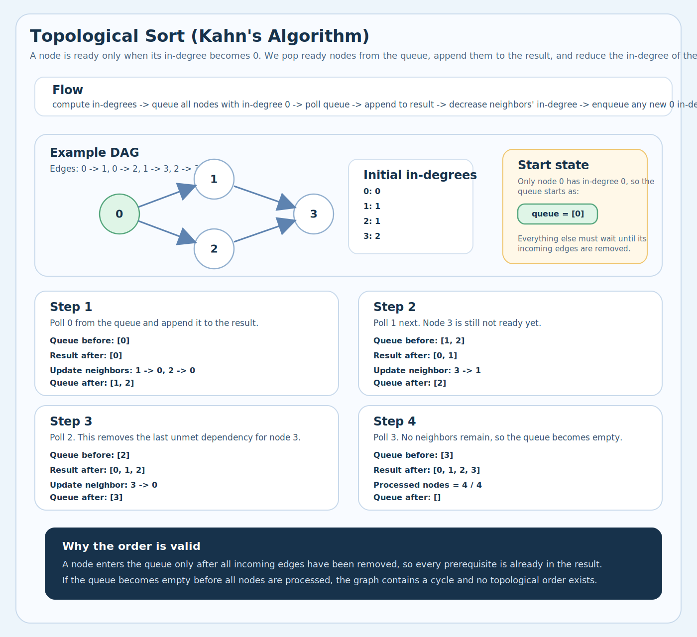

# 1. Topological Sort
<sub>[Back to solutions](../README.md#solutions)</sub>

Given tasks with dependencies, find an order where every task comes <b>after</b> all its prerequisites. Like getting dressed — socks before shoes, underwear before pants.

### Real-life example: getting dressed

Dependencies:

- `underwear -> pants -> belt`
- `socks -> shoes`
- `shirt -> belt`
- `shirt -> tie`

This means:

- You cannot put on `shoes` before `socks`
- You cannot put on `belt` before both `pants` and `shirt`

Valid orders:

- `underwear, socks, shirt, pants, tie, belt, shoes`
- `socks, underwear, shirt, pants, belt, tie, shoes`

Invalid order:

- `belt, pants, ...` because `belt` depends on `pants` first


## 1.1. Idea

<b>Topological sort</b> for <b>Directed Acyclic Graph</b> (DAG) is a linear ordering of vertices such that for every directed edge `u`→`v`, vertex `u` comes before `v` in the ordering. There may be several topological orderings for a graph.

Applies only to DAGs (Directed Acyclic Graphs), and is not possible for cyclic or undirected graphs.
It represents dependency ordering between vertices which is different from normal DFS or BFS traversals.
Used in problems like task scheduling, build order, course prerequisite ordering, etc.

**Graph Representation**

```text
Each task = node
Each dependency = directed edge (A → B means "A before B")

  0 → 1 → 3
  0 → 2 → 3

  "0 must come before 1 and 2"
  "1 and 2 must come before 3"
```

**The Key Concept: In-Degree**

```text
In-degree = number of arrows pointing INTO a node
           = number of prerequisites not yet completed

  0 → 1 → 3
  0 → 2 ↗

  Node 0: in-degree = 0  ← no prerequisites, can start!
  Node 1: in-degree = 1  ← needs 0 first
  Node 2: in-degree = 1  ← needs 0 first
  Node 3: in-degree = 2  ← needs 1 AND 2 first
```

### 1.1.1. BFS (Kahn's Algorithm)

```text
Idea: start with nodes that have NO prerequisites (in-degree = 0)
      process them, reduce neighbors' in-degree, repeat

  Step 1: find all nodes with in-degree 0 → add to queue
  Step 2: poll from queue → add to result
  Step 3: reduce in-degree of neighbors
  Step 4: if neighbor's in-degree becomes 0 → add to queue
  Step 5: if result.size < total nodes → CYCLE exists
```

**Step-by-step**

```text
Graph:  0 → 1 → 3
        0 → 2 → 3

Step 1: Calculate in-degrees

  ┌──────┬───────────┐
  │ Node │ In-degree │
  ├──────┼───────────┤
  │  0   │     0     │ ← ready!
  │  1   │     1     │
  │  2   │     1     │
  │  3   │     2     │
  └──────┴───────────┘

Step 2: Add all in-degree 0 nodes to queue

  Queue:  [0]
  Result: []

Step 3: Process queue

  ┌─────────────────────────────────────────────────────────────┐
  │ Poll 0 from queue → add to result                           │
  │                                                             │
  │   Result: [0]                                               │
  │                                                             │
  │   0's neighbors: 1, 2                                       │
  │   Reduce their in-degrees:                                  │
  │     Node 1: in-degree 1→0  ← becomes 0! Add to queue        │
  │     Node 2: in-degree 1→0  ← becomes 0! Add to queue        │
  │                                                             │
  │   Queue: [1, 2]                                             │
  └─────────────────────────────────────────────────────────────┘

  ┌─────────────────────────────────────────────────────────────┐
  │ Poll 1 from queue → add to result                           │
  │                                                             │
  │   Result: [0, 1]                                            │
  │                                                             │
  │   1's neighbor: 3                                           │
  │   Reduce in-degree:                                         │
  │     Node 3: in-degree 2→1  ← not 0 yet, don't add           │
  │                                                             │
  │   Queue: [2]                                                │
  └─────────────────────────────────────────────────────────────┘

  ┌─────────────────────────────────────────────────────────────┐
  │ Poll 2 from queue → add to result                           │
  │                                                             │
  │   Result: [0, 1, 2]                                         │
  │                                                             │
  │   2's neighbor: 3                                           │
  │   Reduce in-degree:                                         │
  │     Node 3: in-degree 1→0  ← becomes 0! Add to queue        │
  │                                                             │
  │   Queue: [3]                                                │
  └─────────────────────────────────────────────────────────────┘

  ┌─────────────────────────────────────────────────────────────┐
  │ Poll 3 from queue → add to result                           │
  │                                                             │
  │   Result: [0, 1, 2, 3]                                      │
  │                                                             │
  │   3's neighbors: none                                       │
  │                                                             │
  │   Queue: []  → done!                                        │
  └─────────────────────────────────────────────────────────────┘

  All 4 nodes in result → valid order exists ✓
  Result: [0, 1, 2, 3]

```

**What If There's a Cycle?**

```text
  0 → 1 → 2 → 0    (cycle!)

  In-degrees: [1, 1, 1]

  No node has in-degree 0!
  Queue starts EMPTY → result is empty → CYCLE detected

  Another case:
    0 → 1 → 2 → 1  (partial cycle)

  In-degrees: [0, 2, 1]

  Process 0 → in-degree of 1 becomes 1 (not 0)
  Queue empty, but only processed 1 of 3 nodes
  result.size (1) != numNodes (3) → CYCLE detected
```

**Why It Works**

```text
Invariant: a node enters the queue ONLY when
           ALL its prerequisites are already processed

  Node 3 has in-degree 2 (needs 1 AND 2)
  
  After processing 1: in-degree drops to 1 → NOT ready
  After processing 2: in-degree drops to 0 → READY
  
  By the time 3 enters the queue, both 1 and 2
  are already in the result → order is guaranteed correct
```

**Implementation**

```java
public int[] topologicalSort(int numNodes, int[][] edges) {
    List<List<Integer>> graph = new ArrayList<>();
    int[] inDegree = new int[numNodes];

    for (int i = 0; i < numNodes; i++) {
        graph.add(new ArrayList<>());
    }

    // build graph and count in-degrees
    for (int[] edge : edges) {
        graph.get(edge[0]).add(edge[1]);
        inDegree[edge[1]]++;
    }

    // seed queue with all in-degree 0 nodes
    Queue<Integer> queue = new LinkedList<>();
    for (int i = 0; i < numNodes; i++) {
        if (inDegree[i] == 0) queue.offer(i);
    }

    int[] result = new int[numNodes];
    int index = 0;

    while (!queue.isEmpty()) {
        int node = queue.poll();
        result[index++] = node;

        for (int neighbor : graph.get(node)) {
            inDegree[neighbor]--;
            if (inDegree[neighbor] == 0) {
                queue.offer(neighbor);
            }
        }
    }

    // cycle detection: not all nodes processed
    if (index != numNodes) return new int[]{};

    return result;
}
```

### 1.1.2. DFS (Post-order + Reverse)

```text
Idea: DFS to the deepest dependency first, add to stack on backtrack
      reverse gives topological order

  Coloring:
    WHITE = unvisited
    GRAY  = in progress (currently in recursion stack)
    BLACK = fully processed

  If we visit a GRAY node → CYCLE detected
```

**Step-by-step**

```text
4 courses, prerequisites: [[1,0], [2,0], [3,1], [3,2]]
  0 → 1, 0 → 2, 1 → 3, 2 → 3

  in-degree: [0, 1, 1, 2]
              ↑
              start here

  Queue: [0]
  Poll 0 → result [0], reduce neighbors 1,2
    in-degree: [0, 0, 0, 2]
    Queue: [1, 2]

  Poll 1 → result [0, 1], reduce neighbor 3
    in-degree: [0, 0, 0, 1]
    Queue: [2]

  Poll 2 → result [0, 1, 2], reduce neighbor 3
    in-degree: [0, 0, 0, 0]
    Queue: [3]

  Poll 3 → result [0, 1, 2, 3]
    Queue: []

  All 4 nodes processed → valid order: [0, 1, 2, 3] ✓
```

**Implementation**

```java
public int[] topologicalSortDFS(int numNodes, int[][] edges) {
    List<List<Integer>> graph = new ArrayList<>();
    for (int i = 0; i < numNodes; i++) {
        graph.add(new ArrayList<>());
    }
    for (int[] edge : edges) {
        graph.get(edge[0]).add(edge[1]);
    }

    int[] color = new int[numNodes];        // 0=white, 1=gray, 2=black
    Deque<Integer> stack = new ArrayDeque<>();
    boolean[] hasCycle = {false};

    for (int i = 0; i < numNodes; i++) {
        if (color[i] == 0) {
            dfs(graph, i, color, stack, hasCycle);
        }
    }

    if (hasCycle[0]) return new int[]{};

    int[] result = new int[numNodes];
    for (int i = 0; i < numNodes; i++) {
        result[i] = stack.pop();
    }
    return result;
}

private void dfs(List<List<Integer>> graph, int node,
                 int[] color, Deque<Integer> stack, boolean[] hasCycle) {
    if (hasCycle[0]) return;

    color[node] = 1;                        // gray: in progress

    for (int neighbor : graph.get(node)) {
        if (color[neighbor] == 1) {         // gray → cycle!
            hasCycle[0] = true;
            return;
        }
        if (color[neighbor] == 0) {
            dfs(graph, neighbor, color, stack, hasCycle);
        }
    }

    color[node] = 2;                        // black: done
    stack.push(node);                       // post-order
}
```

## 1.2. Illustration



## 1.3. Complexity

**Time complexity:** `O(V + E)`  
Each vertex and each edge is processed once.

**Space complexity:** `O(V)`  
For the queue / stack and indegree bookkeeping.

Where:
- `V` = number of vertices
- `E` = number of edges

## 1.4. How to detect it should be used

Key signals that Topological Sort is the right approach:

1) <b>Order of tasks with dependencies</b> — task B can only start after task A finishes.
2) <b>Course schedule / prerequisites</b> — must complete course A before course B.
3) <b>Build order / compilation order</b> — files depend on other files.
4) <b>Detect cycle in directed graph</b> — if topological sort fails, there's a cycle.
5) <b>Directed Acyclic Graph (DAG)</b> — any ordering problem on a DAG.
6) <b>Sequence / ordering with constraints</b> — arrange elements respecting <b>before/after</b> rules.
7) <b>Alien dictionary</b> — infer ordering from comparisons.

**How to recognize the pattern**
```text
Key words:        "before", "after", "prerequisite",
                  "dependency", "order", "schedule"

Key structure:    directed edges showing "must come before"

  A → B    means A must come before B
  A → C    means A must come before C
  B → D    means B must come before D

  Valid order: A, B, C, D  or  A, C, B, D

```

## 1.5. LeetCode problems

**Medium**
* https://leetcode.com/problems/course-schedule/
* https://leetcode.com/problems/course-schedule-ii/
* https://leetcode.com/problems/minimum-height-trees/
* https://leetcode.com/problems/find-eventual-safe-states/
* https://leetcode.com/problems/course-schedule-iv/
* https://leetcode.com/problems/minimum-number-of-vertices-to-reach-all-nodes/
* https://leetcode.com/problems/find-all-possible-recipes-from-given-supplies/
* https://leetcode.com/problems/all-ancestors-of-a-node-in-a-directed-acyclic-graph/

**Hard**
* https://leetcode.com/problems/alien-dictionary/
* https://leetcode.com/problems/sort-items-by-groups-respecting-dependencies/
* https://leetcode.com/problems/largest-color-value-in-a-directed-graph/
* https://leetcode.com/problems/parallel-courses-iii/
* https://leetcode.com/problems/build-a-matrix-with-conditions/
