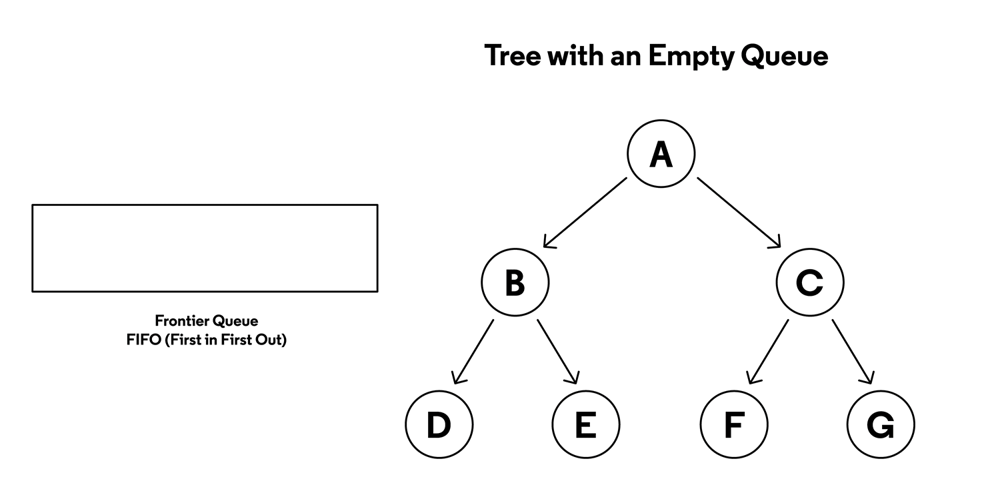
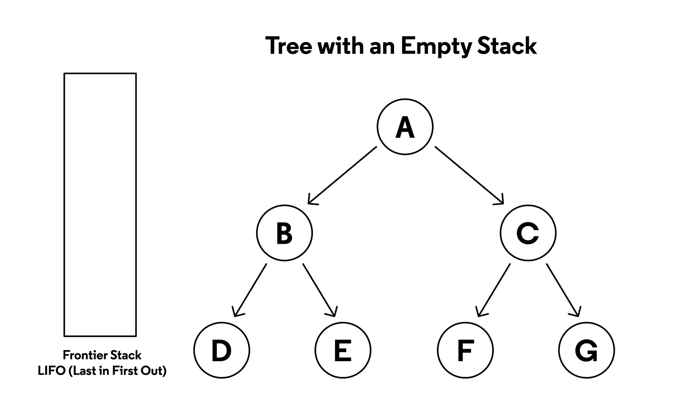
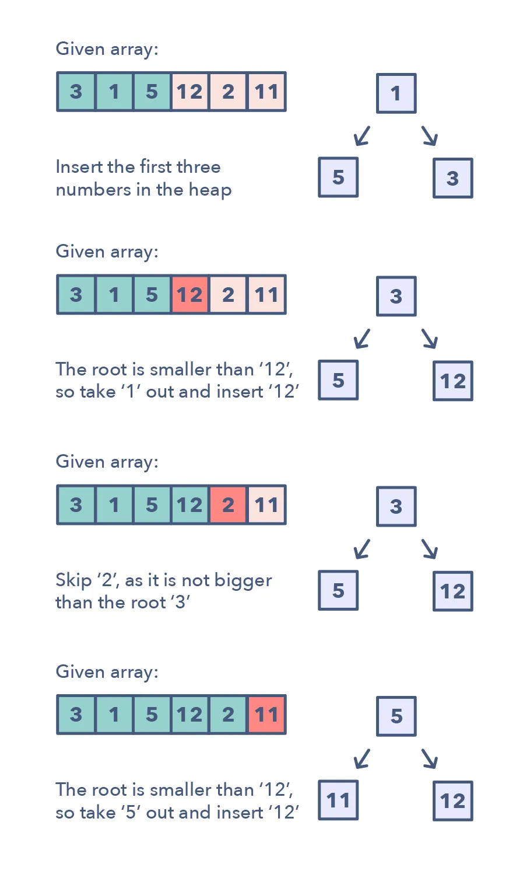
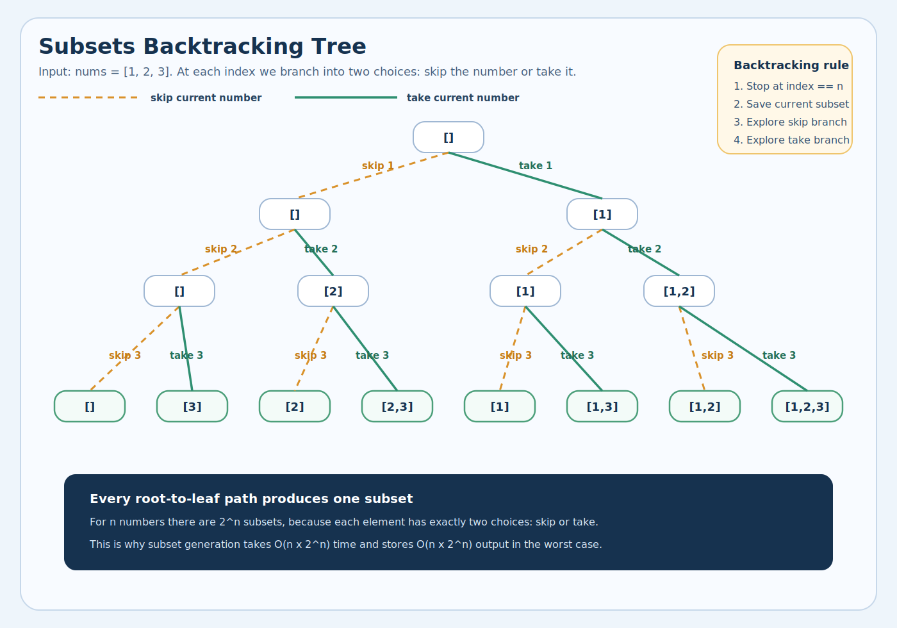

# 1. Breadth-First Search
<sub>[Back to solutions](../README.md#solutions)</sub>

<b>Breadth First Search</b> (BFS) is a graph traversal algorithm that starts from a source node and explores the graph level by level. First, it visits all nodes directly adjacent to the source. Then, it moves on to visit the adjacent nodes of those nodes, and this process continues until all reachable nodes are visited.

* BFS is different from DFS in a way that closest vertices are visited before others. We mainly traverse vertices level by level.
* Popular graph algorithms like Dijkstra's shortest path, Kahn's Algorithm, and Prim's algorithm are based on BFS.
* BFS itself can be used to detect cycle in a directed and undirected graph, find shortest path in an unweighted graph and many more problems.

## 1.1. Idea
The breadth-first search algorithm works by exploring all neighboring nodes before moving to nodes at the next level of depth. It starts from a chosen source node and visits all nodes directly connected to it, then proceeds level by level until all reachable nodes have been explored. This ensures that nodes are visited in order of their distance from the source.

Let’s go through a step-by-step breakdown of how breadth-first search operates:

1) Start from the source node: Choose a starting node to begin traversal.
2) Mark the source as visited: Keep a record of visited nodes to avoid repetition or loops.
3) Enqueue the source node: Use a queue (FIFO structure) to store nodes to be explored.
4) Process the queue: BFS dequeues a node, visits its unvisited neighbors, marks them visited, and enqueues them.
5) Move level by level: Continue until the queue is empty, visiting all nodes layer by layer.

This systematic, level-based approach ensures that BFS finds the shortest route from the source to any other node in an unweighted graph.

For example:

Tree:

        3
       / \
      9   20
         /  \
        15   7

Code:
```java
public List<List<Integer>> bfs(TreeNode root) {
    List<List<Integer>> result = new ArrayList<>();
    if (root == null) return result;

    Queue<TreeNode> queue = new LinkedList<>();
    queue.offer(root);

    while (!queue.isEmpty()) {
        int size = queue.size();
        List<Integer> level = new ArrayList<>();

        for (int i = 0; i < size; i++) {
            TreeNode node = queue.poll();
            level.add(node.val);

            if (node.left != null)  queue.offer(node.left);
            if (node.right != null) queue.offer(node.right);
        }

        result.add(level);
    }

    return result;
}
```

<b>Output</b>: [[3], [9, 20], [15, 7]]<br/>
This is the classic level-order traversal (LeetCode 102).

## 1.2. Illustration



## 1.3. Complexity

Time: O(V + E)<br/>
Space: O(V)<br/>
Where V - vertices and E - edges<br/>

## 1.4. How to detect it should be used
Key signals that BFS is the right approach:

1) <b>Shortest path</b> in an unweighted graph/grid — BFS guarantees the shortest path when all edges have equal weight.
2) <b>Minimum number of steps/moves/operations</b> — any problem asking for the fewest transformations (e.g., word ladder, minimum knight moves).
3) <b>Level-order traversal</b> — explicitly processing nodes level by level in a tree or graph.
4) <b>Nearest</b> / <b>closest</b> — finding the closest node satisfying some condition (nearest gate, nearest zero in a matrix).
5) <b>Spread/expand simultaneously</b> — problems modeled as simultaneous expansion: rotting oranges, walls and gates, multi-source flood fill.
6) <b>All nodes at distance K</b> — anything requiring exploration by distance layers.

## 1.5. LeetCode problems

Easy
* https://leetcode.com/problems/flood-fill/

Medium
* https://leetcode.com/problems/binary-tree-level-order-traversal/
* https://leetcode.com/problems/word-ladder/
* https://leetcode.com/problems/number-of-islands/
* https://leetcode.com/problems/course-schedule/
* https://leetcode.com/problems/course-schedule-ii/
* https://leetcode.com/problems/minimum-height-trees/
* https://leetcode.com/problems/01-matrix/
* https://leetcode.com/problems/open-the-lock/
* https://leetcode.com/problems/rotting-oranges/
* https://leetcode.com/problems/shortest-path-in-binary-matrix/
* https://leetcode.com/problems/as-far-from-land-as-possible/

Hard
* https://leetcode.com/problems/word-ladder-ii/
* https://leetcode.com/problems/shortest-path-to-get-all-keys/

---

# 2. Depth-First Search
<sub>[Back to solutions](../README.md#solutions)</sub>

<b>Depth-First Search</b> (DFS) is one of the most fundamental algorithms in computer science, used for traversing or searching data structures such as trees and graphs. It explores as far as possible along one branch before backtracking, making it particularly useful for scenarios like pathfinding, solving puzzles, and detecting cycles.

<b>Depth-First Search</b> is an algorithm used for searching tree data structures for a particular node or a node with a particular value associated with it. It is also more generally used as a tree traversal algorithm, specifying an order in which to exhaustively access all nodes of a tree.

The algorithm begins at the root node and explores deeper into the tree until it reaches a leaf node. Then, it backtracks up the tree until it finds an unexplored child node. This process continues until the desired node is found or all nodes have been explored.

Key characteristics:

* Recursive nature: The natural recursive structure of DFS makes it easier to implement, but for very deep graphs, recursion can lead to stack overflow unless converted to an iterative approach.
* Memory usage: DFS generally requires less memory than BFS (Breadth-First Search) because it only stores the path it’s currently exploring, not all nodes at the current level.
* Deterministic traversal: For a given starting point and adjacency ordering, DFS will always produce the same traversal order, making it predictable for testing and debugging.
* Risk of infinite loops: If the graph has cycles and we don’t mark visited nodes, DFS can get stuck in an infinite loop. Hence, maintaining a visited set or array is crucial.

## 2.1. Idea

There are two strategies for implementing Depth-First Search:

* Recursive implementation
* Iterative implementation

Let’s go through them one by one.

### 2.1.1. Recursive implementation
The recursive version of the algorithm works by starting at the root node and breaking the tree up into subtrees, until it finds the target node, or until every node in the tree has been considered as the root of a subtree. We recursively call the function on all of our root’s children, treating each child node as a root of its own subtree.

We define a function that accepts a tree node and a target value as input parameters. The recursive DFS algorithm implements the following logic:

If the input node value matches our target value, then return the input node.
For each child of the input node, recursively call this function and return the first non-null value returned by a recursive call.
If this root node has no children, or the recursive calls did not return any node, then return null.
To search a tree with this function, we invoke the function with the root node of our tree.

For example

        3
       / \
      9   20
         /  \
        15   7

```java
public List<Integer> dfs(TreeNode root) {
    List<Integer> result = new ArrayList<>();
    traverse(root, result);
    return result;
}

private void traverse(TreeNode node, List<Integer> result) {
    if (node == null) return;

    result.add(node.val);      // pre-order: process before children
    traverse(node.left, result);
    traverse(node.right, result);
}
```
<b>Output</b>: [3, 9, 20, 15, 7]


### 2.1.2. Iterative implementation
The iterative algorithm does not make use of any recursive calls. Instead, we maintain a stack of references to unexplored siblings of the nodes we have already accessed. The recursive algorithm is effectively doing something very similar, but the program call stack is implicitly used to store the path from the root to the current node.

With the iterative algorithm, we need to implement a stack ourselves. These two implementations have the same time and space complexity, so the choice of which to implement is usually a matter of personal preference.

For example

        3
       / \
      9   20
         /  \
        15   7

```java
public List<Integer> dfs(TreeNode root) {
    List<Integer> result = new ArrayList<>();
    if (root == null) return result;

    Stack<TreeNode> stack = new Stack<>();
    stack.push(root);

    while (!stack.isEmpty()) {
        TreeNode node = stack.pop();
        result.add(node.val);

        if (node.right != null) stack.push(node.right);  // right first
        if (node.left != null)  stack.push(node.left);   // so left is processed first
    }

    return result;
}
```
<b>Output</b>: [3, 9, 20, 15, 7]


## 2.2. Illustration



## 2.3. Complexity
Time: O(n)<br/>
Space: O(n)

## 2.4. How to detect it should be used

Key signals that DFS is the right approach:

1) <b>Find all paths / any path</b> — exploring every possible route (e.g., all paths from source to target).
2) <b>Permutations / combinations / subsets</b> — backtracking problems that build candidates incrementally.
3) <b>Connected components / islands</b> — flood-fill style marking of reachable regions.
4) <b>Detect a cycle</b> — in directed or undirected graphs.
5) <b>Topological sort</b> — ordering tasks with dependencies (DFS post-order + reverse).
6) <b>Tree depth / height / diameter</b> — problems requiring you to go deep before going wide.
7) <b>Validate structure recursively</b> — e.g., validate BST, symmetric tree, same tree.
8) <b>Path with a constraint</b> — path sum, max path sum, longest path — where you need to explore branches fully.

## 2.5. LeetCode problems

Easy
* https://leetcode.com/problems/binary-tree-inorder-traversal/
* https://leetcode.com/problems/symmetric-tree/
* https://leetcode.com/problems/path-sum/
* https://leetcode.com/problems/binary-tree-preorder-traversal/
* https://leetcode.com/problems/binary-tree-postorder-traversal/
* https://leetcode.com/problems/maximum-depth-of-n-ary-tree/
* https://leetcode.com/problems/flood-fill/

Medium
* https://leetcode.com/problems/letter-combinations-of-a-phone-number/
* https://leetcode.com/problems/combination-sum/
* https://leetcode.com/problems/combination-sum-ii/
* https://leetcode.com/problems/permutations/
* https://leetcode.com/problems/permutations-ii/
* https://leetcode.com/problems/subsets/
* https://leetcode.com/problems/word-search/
* https://leetcode.com/problems/subsets-ii/
* https://leetcode.com/problems/validate-binary-search-tree/
* https://leetcode.com/problems/path-sum-ii/
* https://leetcode.com/problems/surrounded-regions/
* https://leetcode.com/problems/clone-graph/
* https://leetcode.com/problems/number-of-islands/
* https://leetcode.com/problems/course-schedule/
* https://leetcode.com/problems/course-schedule-ii/
* https://leetcode.com/problems/evaluate-division/
* https://leetcode.com/problems/pacific-atlantic-water-flow/
* https://leetcode.com/problems/target-sum/
* https://leetcode.com/problems/number-of-provinces/
* https://leetcode.com/problems/max-area-of-island/
* https://leetcode.com/problems/is-graph-bipartite/
* https://leetcode.com/problems/all-paths-from-source-to-target/
* https://leetcode.com/problems/find-eventual-safe-states/
* https://leetcode.com/problems/number-of-enclaves/

Hard
* https://leetcode.com/problems/word-ladder-ii/
* https://leetcode.com/problems/word-break-ii/
* https://leetcode.com/problems/word-search-ii/
* https://leetcode.com/problems/longest-increasing-path-in-a-matrix/
* https://leetcode.com/problems/regions-cut-by-slashes/
* https://leetcode.com/problems/unique-paths-iii/
* https://leetcode.com/problems/critical-connections-in-a-network/

---

# 3. Top K Elements
<sub>[Back to solutions](../README.md#solutions)</sub>

Maintain a <b>heap of size K</b> that acts as a <b>gatekeeper</b> — only the "best" K elements survive.

## 3.1. Idea
Imagine a room with K chairs. People arrive one by one:

```text
Room capacity: 3 chairs (K = 3)
Goal: keep the 3 TALLEST people

Person arrives → Room not full?
                  YES → sit down
                  NO  → compare with the SHORTEST person sitting
                         Taller?  → shortest leaves, new person sits
                         Shorter? → new person leaves
```

### 3.1.1. K largest 

```java
public int[] topKLargest(int[] nums, int k) {
    PriorityQueue<Integer> minHeap = new PriorityQueue<>();

    for (int num : nums) {
        minHeap.offer(num); // add every element to the heap
        if (minHeap.size() > k) { // evict the smallest, only K largest survive
            minHeap.poll();
        }
    }

    // remaining K elements are the answer
    int[] result = new int[k];
    for (int i = 0; i < k; i++) {
        result[i] = minHeap.poll();
    }
    return result;
}
```

### 3.1.2. K smallest

```java
public int[] bottomKSmallest(int[] nums, int k) {
    // largest element sits on top
    PriorityQueue<Integer> maxHeap = new PriorityQueue<>(Collections.reverseOrder());

    for (int num : nums) {
        maxHeap.offer(num); // add every element to the heap
        if (maxHeap.size() > k) { // evict the largest, only K smallest survive
            maxHeap.poll();
        }
    }

    // remaining K elements are the answer
    int[] result = new int[k];
    for (int i = 0; i < k; i++) {
        result[i] = maxHeap.poll();
    }
    return result;
}
```

## 3.2. Illustration


## 3.3. Complexity

Time: O(N log K) - each offer/poll is O(log k), done n times<br/>
Space: O(K) - heap never exceeds size k<br/>

### 3.3.1. Why not just sort?
| Approach       | Time       | Space | When to use               |
|----------------|------------|-------|---------------------------|
| Full sort      | O(n log n) | O(n)  | Need all elements ordered |
| Heap of size K | O(n log k) | O(k)  | Only need top K ✓         |
| QuickSelect    | O(n) avg   | O(1)  | Only need the Kth element |

When K is much smaller than N, the heap approach wins:

```text
n = 1,000,000    k = 10

Sort:        O(n log n) = ~20,000,000 operations
Heap size K: O(n log k) = ~3,300,000 operations  ← 6x faster
```

## 3.4. How to detect it should be used

Key signals that Top K Elements is the right approach:

1) <b>K largest / K smallest</b> — find the K biggest or smallest elements.
2) <b>K most frequent</b> — top K elements by frequency/count.
3) <b>K closest</b> — K nearest points, K closest to a value.
4) <b>Kth largest / Kth smallest</b> — find the single element at position K.
5) <b>Sort partially</b> — don't need full sort, just the top/bottom K.
6) <b>Streaming data</b> — maintain top K as elements arrive continuously.

## 3.5. LeetCode problems

Easy
* https://leetcode.com/problems/kth-largest-element-in-a-stream/

Medium
* https://leetcode.com/problems/kth-largest-element-in-an-array/
* https://leetcode.com/problems/top-k-frequent-elements/
* https://leetcode.com/problems/top-k-frequent-words/
* https://leetcode.com/problems/k-closest-points-to-origin/

---

# 4. Intervals
<sub>[Back to solutions](../README.md#solutions)</sub>

The Interval pattern is a powerful way to reason about problems involving ranges of values, whether time spans, numeric ranges, or geometric spans. Each interval is defined by a start and an end; for example, [10,20] represents everything from 10 through 20.

> [!NOTE]
> Two intervals overlap if the start of one is less than or equal to the end of the other.

## 4.1. Idea
Interval questions are a subset of array questions where you are given an array of two-element arrays (an interval) and the two values represent a start and an end value. Interval questions are considered part of the array family but they involve some common techniques hence they are extracted out to this special section of their own.

An example interval array: [[1, 2], [4, 7]].

Interval questions can be tricky to those who have not tried them before because of the sheer number of cases to consider when they overlap.

Corner cases:
* No intervals
* Single interval
* Two intervals
* Non-overlapping intervals
* An interval totally consumed within another interval
* Duplicate intervals (exactly the same start and end)
* Intervals which start right where another interval ends - [[1, 2], [2, 3]]

### 4.1.1. Merge intervals

```java
public int[][] merge(int[][] intervals) {
    Arrays.sort(intervals, (a, b) -> a[0] - b[0]);  // sort by start

    List<int[]> result = new ArrayList<>();
    int[] current = intervals[0];
    result.add(current);

    for (int[] next : intervals) {
        if (next[0] <= current[1]) {
            current[1] = Math.max(current[1], next[1]);  // merge
        } else {
            current = next;                                // no overlap
            result.add(current);
        }
    }

    return result.toArray(new int[result.size()][]);
}
```

```text
Input (sorted):  [[1,3], [2,6], [8,10], [15,18]]

[1,3] + [2,6] → overlap (2 ≤ 3) → merge → [1,6]
[1,6] + [8,10] → no overlap (8 > 6) → keep separate
[8,10] + [15,18] → no overlap (15 > 10) → keep separate

Output: [[1,6], [8,10], [15,18]]
```

### 4.1.2. Insert Interval

```java
public int[][] insert(int[][] intervals, int[] newInterval) {
    List<int[]> result = new ArrayList<>();
    int i = 0;
    int n = intervals.length;

    // 1. add all intervals that come BEFORE new interval
    while (i < n && intervals[i][1] < newInterval[0]) {
        result.add(intervals[i]);
        i++;
    }

    // 2. merge all overlapping intervals with new interval
    while (i < n && intervals[i][0] <= newInterval[1]) {
        newInterval[0] = Math.min(newInterval[0], intervals[i][0]);
        newInterval[1] = Math.max(newInterval[1], intervals[i][1]);
        i++;
    }
    result.add(newInterval);

    // 3. add all intervals that come AFTER new interval
    while (i < n) {
        result.add(intervals[i]);
        i++;
    }

    return result.toArray(new int[result.size()][]);
}
```

```text
Input: [[1,3], [6,9]]  newInterval: [2,5]

Before [2,5]: [1,3] → end 3 ≥ start 2 → not before, stop
Overlap:      [1,3] overlaps → merge → [1,5]
              [6,9] → start 6 > end 5 → no overlap, stop
After:        [6,9]

Output: [[1,5], [6,9]]

```

### 4.1.3. Check Overlap

```java
public boolean canAttendMeetings(int[][] intervals) {
    Arrays.sort(intervals, (a, b) -> a[0] - b[0]);

    for (int i = 1; i < intervals.length; i++) {
        if (intervals[i][0] < intervals[i - 1][1]) {
            return false;   // overlap found
        }
    }

    return true;
}
```

### 4.1.4. Minimum Meetings Room

```java
public int minMeetingRooms(int[][] intervals) {
    Arrays.sort(intervals, (a, b) -> a[0] - b[0]);  // sort by start

    // min-heap tracks end times of active meetings
    PriorityQueue<Integer> minHeap = new PriorityQueue<>();

    for (int[] interval : intervals) {
        // earliest meeting ended before this one starts → reuse room
        if (!minHeap.isEmpty() && minHeap.peek() <= interval[0]) {
            minHeap.poll();
        }
        minHeap.offer(interval[1]);  // allocate room with this end time
    }

    return minHeap.size();  // rooms still in use = rooms needed
}
```

```text
Input: [[0,30], [5,10], [15,20]]

sort by start → [[0,30], [5,10], [15,20]]

[0,30]  → heap empty → add 30          heap: [30]         rooms: 1
[5,10]  → peek 30 > 5 → can't reuse   heap: [10, 30]     rooms: 2
         → add 10
[15,20] → peek 10 ≤ 15 → reuse room   heap: [20, 30]     rooms: 2
         → poll 10, add 20

Result: 2 rooms

```

## 4.2. Illustration


## 4.3. Complexity

Time: O(N * log N) where N is the total number of intervals. In the beginning, since we sort the intervals, our algorithm will take O(N * log N) to run.<br/>
Space: O(N), as we need to return a list containing all the merged intervals.

## 4.4. How to detect it should be used

This approach is quite useful when dealing with intervals, overlapping items or merging intervals.

## 4.5. LeetCode problems

Easy
* https://leetcode.com/problems/meeting-rooms/
* https://leetcode.com/problems/points-that-intersect-with-cars/

Medium
* https://leetcode.com/problems/merge-intervals/
* https://leetcode.com/problems/insert-interval/
* https://leetcode.com/problems/meeting-rooms-ii/
* https://leetcode.com/problems/non-overlapping-intervals/
* https://leetcode.com/problems/find-right-interval/
* https://leetcode.com/problems/minimum-number-of-arrows-to-burst-balloons/
* https://leetcode.com/problems/my-calendar-i/
* https://leetcode.com/problems/my-calendar-ii/
* https://leetcode.com/problems/interval-list-intersections/
* https://leetcode.com/problems/video-stitching/
* https://leetcode.com/problems/car-pooling/
* https://leetcode.com/problems/meeting-scheduler/
* https://leetcode.com/problems/remove-covered-intervals/
* https://leetcode.com/problems/maximum-number-of-events-that-can-be-attended/
* https://leetcode.com/problems/the-number-of-the-smallest-unoccupied-chair/
* https://leetcode.com/problems/divide-intervals-into-minimum-number-of-groups/
* https://leetcode.com/problems/count-days-without-meetings/

Hard
* https://leetcode.com/problems/data-stream-as-disjoint-intervals/
* https://leetcode.com/problems/my-calendar-iii/
* https://leetcode.com/problems/set-intersection-size-at-least-two/
* https://leetcode.com/problems/employee-free-time/
* https://leetcode.com/problems/minimum-interval-to-include-each-query/
* https://leetcode.com/problems/minimum-time-to-complete-all-tasks/

---

# 5. Subsets

A subset is a set whose all elements are contained within another set. A subset is indicated by the symbol '⊆' and read as 'is a subset of' in set theory.

## 5.1. Idea
For each element, make a <b>binary decision: include it</b> or <b>skip it</b>. Every combination of these decisions produces a unique subset.

```text
Input: [1, 2]

Element 1: include or skip?
Element 2: include or skip?

          start []
         /          \
    include 1      skip 1
      [1]            []
     /    \         /    \
  incl 2  skip 2  incl 2  skip 2
  [1,2]    [1]     [2]      []

All subsets: [[], [1], [2], [1,2]]

```

```java
public List<List<Integer>> subsets(int[] nums) {
    List<List<Integer>> result = new ArrayList<>();
    backtrack(result, new ArrayList<>(), nums, 0);
    return result;
}
                                                        //  Time contribution
private void backtrack(List<List<Integer>> result,      //
                       List<Integer> path,              //
                       int[] nums, int start) {         //
    result.add(new ArrayList<>(path));                  //  O(n) copy × 2ⁿ calls

    for (int i = start; i < nums.length; i++) {
        path.add(nums[i]);                              //  O(1)
        backtrack(result, path, nums, i + 1);           //  2ⁿ total calls
        path.remove(path.size() - 1);                   //  O(1)
    }
}
```

<b>Summary</b>
```text
1. Start with empty path []
2. At each step:
   a. Snapshot current path into result (every path is a valid subset)
   b. Try adding each remaining element (from start to end)
   c. Go deeper with that element
   d. Remove it and try the next one
3. "start" parameter ensures we never go backward → no duplicates
4. Recursion naturally explores all 2ⁿ combinations
```


## 5.2. Illustration



## 5.3. Complexity

<b>Time: O(n × 2ⁿ)</b><br/>
<b>Space: O(n × 2ⁿ)</b><br/>

## 5.4. How to detect it should be used

Key signals that Subsets pattern is the right approach:

1) <b>Find all subsets / power set</b> — generate every possible combination of elements.
2) <b>Find all combinations</b> — pick K elements from N in all possible ways.
3) <b>Find all permutations</b> — arrange elements in every possible order.
4) <b>Generate all valid / possible</b> — enumerate all valid states (parentheses, IP addresses, letter combos).
5) <b>Partition into groups</b> — split a set into subsets satisfying constraints.
6) <b>Can you achieve target using subset?</b> — subset sum, combination sum.

## 5.5. LeetCode problems

Medium
* https://leetcode.com/problems/letter-combinations-of-a-phone-number/
* https://leetcode.com/problems/generate-parentheses/
* https://leetcode.com/problems/combination-sum/
* https://leetcode.com/problems/combination-sum-ii/
* https://leetcode.com/problems/permutations/
* https://leetcode.com/problems/permutations-ii/
* https://leetcode.com/problems/combinations/
* https://leetcode.com/problems/subsets/
* https://leetcode.com/problems/subsets-ii/
* https://leetcode.com/problems/letter-case-permutation/

---

# 6. Two Heaps
<sub>[Back to solutions](../README.md#solutions)</sub>

Imagine you’re managing a busy airport. Flights are constantly landing and taking off, and you need to quickly find the next most important flight—an emergency landing or a VIP departure. At the same time, new flights must be integrated into the schedule. How do you track all this while finding the highest-priority flight quickly? Without an efficient data structure, you’d have to scan the entire schedule every time a decision is needed, which can be slow and error-prone as the number of flights grows. The time complexity of this inefficient system will be O(n) for each decision, where n is the number of flights because it requires scanning the entire schedule to find the highest-priority flight.

The solution is heaps.

<b>Heap</b> is a special data structure that helps you efficiently manage priorities. With a min heap, you can always find the flight with the earliest priority, and with a max heap, you can focus on flights that have been waiting for the longest—all while making updates quickly when new flights are added.

A heap is a specialized binary tree that satisfies the heap property:

* <b>Min heap</b>: The value of each node is smaller than or equal to the values of its children. The root node holds the minimum value. A min heap always prioritizes the minimum value.

* <b>Max heap</b>: The value of each node is greater than or equal to the values of its children. The root node holds the maximum value. A max heap always prioritizes the maximum value.

* <b>Priority queue</b>: A priority queue is an abstract data type retrieves elements based on their custom priority. It is often implemented using a heap for efficiency.

A heap is a specific data structure with a fixed ordering (min or max), while a priority queue is an abstract data type that handles custom priority requirements for elements.

> [!NOTE]
> A heap is a specific data structure with a fixed ordering (min or max), while a priority queue is an abstract data type that handles custom priority requirements for elements.

## 6.1. Idea

In many problems, where we are given a set of elements such that we can divide them into two parts. To solve the problem, we are interested in knowing the smallest element in one part and the biggest element in the other part. This pattern is an efficient approach to solve such problems.

This pattern uses two Heaps to solve these problems; A <b>Min Heap</b> to find the smallest element and a <b>Max Heap</b> to find the biggest element.

Let’s assume that x is the median of the list. This means that, half of the items in the list are smaller than (or equal to) x and other half is greater than (or equal to) x.

1. We can store the smaller part of the list in a <b>Max Heap</b>. We are using <b>Max Heap</b> because we are only interested in knowing the largest number in the first half of the list.
2. We can store the larger part of the list in a <b>Min Heap</b>. We are using <b>Min Heap</b> because we are only interested in knowing the smallest number in the second half of the list.
3. Inserting a number in a heap will take O(log N) (better than the brute force approach)
4. The median of the current list of numbers can be calculated from the top element of the two heaps.

## 6.2. Illustration


## 6.3. Complexity

Time: O (log N) for insertions, O(1) - to find median<br/>
Space: O(N)

## 6.4. How to detect it should be used

This approach is quite useful when dealing with the problems where we are given a set of elements such that we can divide them into two parts.

To be able to solve these kinds of problems, we want to know the smallest element in one part and the biggest element in the other part. Two Heaps pattern uses two Heap data structure to solve these problems; a <b>Min Heap</b> to find the smallest element and a <b>Max Heap</b> to find the biggest element.

## 6.5. LeetCode problems

Two Heaps is a small pattern on LeetCode, and the standard public set is all Hard.

Hard
* https://leetcode.com/problems/find-median-from-data-stream/
* https://leetcode.com/problems/sliding-window-median/
* https://leetcode.com/problems/ipo/

---
