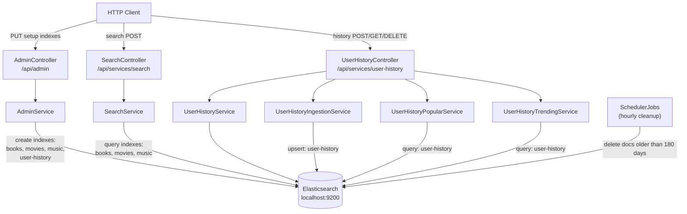
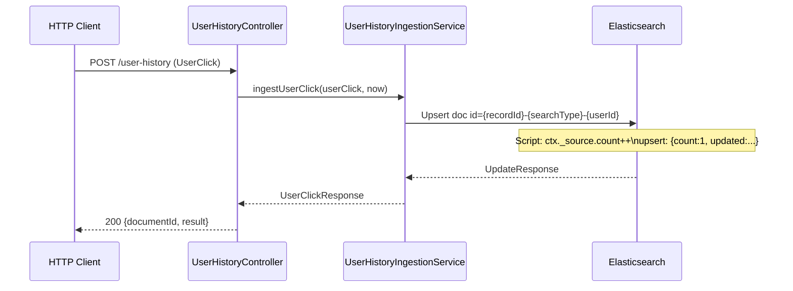

# Elasticsearch

An Elasticsearch-backed search and user-history service. Exposes multiple query strategies
via REST, ingests user click events into a history index, and returns popular/trending search history.

> **First time setup:** call the `AdminController` endpoints once to create all required
> indexes and their field mappings before using `SearchController` or `UserHistoryController`.

**Stack:** Spring Boot, Spring Data Elasticsearch, Swagger/OpenAPI, Cucumber (BDD)

---

## Quick Start

**Prerequisites:**
- Elasticsearch running on `localhost:9200` (HTTPS, Basic auth) [Docker installation](https://www.elastic.co/docs/deploy-manage/deploy/self-managed/local-development-installation-quickstart) 
- *(If SSL enabled) CA certificate placed at `src/main/resources/cert/http_ca.crt`

```bash
mvn -pl elastic spring-boot:run
```

| URL | Description |
|-----|-------------|
| http://localhost:8001/swagger-ui/index.html | Swagger UI |
| http://localhost:8001/v3/api-docs | OpenAPI JSON |

---

## Architecture



---

## API Reference

### Admin — `/api/admin`

One-time setup endpoints. Call these **before** using `SearchController` or
`UserHistoryController`. Each endpoint creates a specific index with a fixed, pre-defined
schema — no request body or path variables are accepted.

| Method | Path | Creates index | Used by |
|--------|------|---------------|---------|
| `PUT` | `/api/admin/indexes/user-history` | `user-history` | `UserHistoryController` |
| `PUT` | `/api/admin/indexes/books` | `books` | `SearchController` |
| `PUT` | `/api/admin/indexes/movies` | `movies` | `SearchController` |
| `PUT` | `/api/admin/indexes/music` | `music` | `SearchController` |

**Response — `CreateIndexResponse`:**

```json
{
  "index": "user-history",
  "acknowledged": true,
  "shards_acknowledged": true
}
```

Calling an endpoint when the index already exists returns `500` with an ES
`resource_already_exists_exception` message.

#### Index field mappings

**`user-history`** — field types are chosen to match the exact queries used at runtime:

| Field | ES type | Rationale |
|-------|---------|-----------|
| `count` | `long` | incremented by the Painless upsert script |
| `updated` | `date` (`strict_date_optional_time`) | used in range queries by `UserHistoryTrendingService` |
| `userId` | `keyword` | exact-match term query in `UserHistoryPopularService` |
| `recordId` | `keyword` | used in aggregations in `UserHistoryTrendingService` |
| `searchType` | `keyword` | exact-match term query |
| `elasticId` | `keyword` | composite document ID, not queried |
| `searchValue` | `text` | stored only, not queried directly |

**`books`** — `name`, `author`, `synopsis` — all `text` (full-text search)

**`movies`** — `name`, `director`, `synopsis` — all `text` (full-text search)

**`music`** — `band`, `album`, `name`, `lyrics` — all `text` (full-text search)

Fields match exactly what is configured in `metadata.json` and queried by `SearchService`.

---

### Search — `/api/services/search`

All search endpoints accept `POST` with `application/json` and return `application/json`.

| Method | Path | Query strategy |
|--------|------|----------------|
| `POST` | `/api/services/search` | Multi-index search (msearch across configured fields) |
| `POST` | `/api/services/search/wildcard` | Wildcard + SimpleQueryString |
| `POST` | `/api/services/search/fuzzy` | MatchQuery with fuzziness=2 |
| `POST` | `/api/services/search/interval` | IntervalsQuery (maxGaps=3, ordered=true) |
| `POST` | `/api/services/search/span` | SpanNearQuery (slop=3, inOrder=true) |

**Request body — `SeekRequest`:**

```json
{
  "type": "ALL",
  "pattern": "imprisoned",
  "client": "WEB"
}
```

| Field | Type | Allowed values |
|-------|------|----------------|
| `type` | String | `ALL`, `BOOKS`, `COMPANIES`, `MUSIC`, `MOVIES`, `PEOPLE` |
| `pattern` | String | Search string (wildcards `*`/`?` allowed for wildcard endpoint) |
| `client` | String | `MOBILE`, `WEB` |

Both `type` and `client` are validated with `@ValueOfEnum` — case-insensitive, 400 on invalid value.

---

### User History — `/api/services/user-history`

#### Ingest a user click

```
POST /api/services/user-history
```

Request body — `UserClick`:

```json
{
  "userId": "nl84439",
  "recordId": "did-1",
  "searchType": "People",
  "searchPattern": "John"
}
```

All fields are required (`@NotEmpty` / `@NotBlank`). On each call the service upserts a document
into the `user-history` index — it creates the document on first occurrence and increments
`count` on subsequent calls for the same `(recordId, searchType, userId)` combination.

Response — `UserClickResponse`:

```json
{
  "documentId": "did-1-People-nl84439",
  "result": "Updated"
}
```

---

#### Retrieve history

| Method | Path | Description |
|--------|------|-------------|
| `GET` | `/api/services/user-history/documents/{documentId}` | Get a single document by ES document ID |
| `GET` | `/api/services/user-history/users/{userId}?size=10` | Popular searches for a specific user (sorted by count DESC) |
| `GET` | `/api/services/user-history/users?size=10` | Global trending searches in the last 7 days |

#### Delete

| Method | Path | Description |
|--------|------|-------------|
| `DELETE` | `/api/services/user-history/indexes/{index}` | Delete an entire index |
| `DELETE` | `/api/services/user-history/indexes/{index}/documents/{documentId}` | Delete a single document |

---

## Data Model

### `UserHistory` (Elasticsearch document, index: `user-history`)

| Field | Type | Description |
|-------|------|-------------|
| `elasticId` | String | Composite key: `{recordId}-{searchType}-{userId}` |
| `userId` | String | User identifier |
| `recordId` | String | Identifier of the record that was clicked |
| `searchType` | String | Category of the search (e.g. `People`, `Books`) |
| `searchValue` | String | The search pattern used |
| `count` | Long | Number of times this record was clicked |
| `updated` | String | ISO 8601 timestamp of last update |

### `UserClick` (inbound event)

| Field | Constraint | Description |
|-------|-----------|-------------|
| `userId` | `@NotEmpty` | User identifier |
| `recordId` | `@NotBlank` | Record being clicked |
| `searchType` | `@NotBlank` | Search category |
| `searchPattern` | `@NotBlank` | Search pattern |

---

## User History Lifecycle



---

## Configuration

`elastic/src/main/resources/application.yaml`:

```yaml
scheduler:
  enabled: true          # set false to disable hourly cleanup job

server:
  port: "8001"

spring:
  elastic:
    cluster:
      host: "localhost"
      port: "9200"
      user: "elastic"
      pass: "elastic"
      schema: "https"    # use "http" for unsecured local instances
      ssl:
        enabled: false
        path: "cert/http_ca.crt"  # CA cert used by Kibana to connect to ES

springdoc:
  swagger-ui:
    tagsSorter: alpha
```

The SSL certificate is loaded from the classpath. Place the `.crt` file in
`src/main/resources/cert/` before starting the application.

### Docker security enabled check

Next command allows you to check HTTP SSL status & password in ES docker image  (local running)
```bash
docker inspect es-local-dev --format '{{range .Config.Env}}{{println .}}{{end}}' \
| grep -E 'xpack.security.enabled|xpack.security.http.ssl.enabled|ELASTIC_PASSWORD'
```
Output:
```bash
xpack.security.enabled=true
xpack.security.http.ssl.enabled=false
ELASTIC_PASSWORD=FverGoe0
```

---

## Scheduler

`SchedulerJobs` runs a cleanup task every hour (`0 0 * * * *`) when `scheduler.enabled=true`.
It deletes all documents from the `user-history` index where `updated` is older than 180 days.

Disable for local development:

```yaml
scheduler:
  enabled: false
```

---

## Query Types

### Default (multi-search)

Executes an Elasticsearch `_msearch` request across all index fields configured for the
given `SeekType` in `metadata.json`. Returns raw Elasticsearch `Document` objects.

### Wildcard

Wildcard queries match words with missing characters, prefixes, or suffixes. Supports:
- `*` — zero or more characters
- `?` — exactly one character

Example: `god*ather` matches `godfather`, `godmother`, etc.

```json
{
  "query": {
    "wildcard": {
      "synopsis": { "value": "imprisoned*" }
    }
  }
}
```

### Fuzzy

Fuzzy queries find terms similar to the search term using
[Levenshtein edit distance](https://en.wikipedia.org/wiki/Levenshtein_distance).
An edit distance counts single-character changes (insert, delete, substitute, transpose).

Example: `imprtdoned` (fuzziness=2) still matches `imprisoned`.

```json
{
  "query": {
    "fuzzy": {
      "synopsis": { "value": "imprtdoned", "fuzziness": 2 }
    }
  }
}
```

### Interval

Interval queries give fine-grained control over the proximity and order of matching terms.
The service uses `maxGaps=3, ordered=true` — matched terms must appear within 3 tokens of each
other in the specified order.

### Span

Span queries are low-level positional queries suited for legal or patent documents where
exact term ordering and proximity matter. The service uses `slop=3, inOrder=true`.

```json
{
  "query": {
    "span_near": {
      "clauses": [
        { "span_term": { "synopsis": "imprisoned" } },
        { "span_term": { "synopsis": "over" } }
      ],
      "slop": 3,
      "in_order": true
    }
  }
}
```

---

## Validation

### Bean Validation on request bodies

Endpoints annotated with `@Valid` trigger Jakarta Bean Validation. Invalid requests return `400`.

| Annotation | Applied to | Meaning |
|-----------|-----------|---------|
| `@NotEmpty` | `userId` | Must not be null or empty |
| `@NotBlank` | `recordId`, `searchType`, `searchPattern` | Must not be blank |
| `@ValueOfEnum` | `type`, `client` in `SeekRequest` | Must match a known enum constant (case-insensitive) |

### `@ValueOfEnum` — Custom enum validator

Validates that a `String` field matches one of the constants of a given enum class.
Case-insensitive comparison is applied, `null` values are allowed (treated as valid).

Usage:

```java
@ValueOfEnum(enumClass = SeekType.class)
String type;
```

---

## Error Handling

`ErrorExceptionHandler` (`@ControllerAdvice`) catches all `Throwable` exceptions and returns:

```
HTTP 500 Internal Server Error
Content-Type: application/json
Body: <exception message>
```

The full stack trace is logged at `ERROR` level.

---

## CORS — Swagger "Failed to fetch"

If Swagger UI returns a CORS error:

```
Failed to fetch.
Possible Reasons: CORS / Network Failure / URL scheme must be "http" or "https"
```

This is typically caused by an ad-blocking browser extension intercepting the request.

**Fix:**
1. Disable or remove the ad-blocking extension for `localhost`.
2. Restart the application, refresh the browser, and clear browser cache.
3. Retry the request from Swagger UI.

---

## Dev Console Queries

Use the Kibana Dev Console (or any Elasticsearch REST client) to interact with the
`user-history` index directly.

### Create the index

```json
PUT user-history
```

### Add a date mapping for the `updated` field

```json
PUT /user-history/_mapping
{
  "properties": {
    "updated": { "type": "date" }
  }
}
```

### Upsert a document (increment count on existing)

```json
POST /user-history/_update/did-1-People-nl84439
{
  "script": {
    "source": "ctx._source.count++; ctx._source.updated = params['updated'];",
    "params": { "updated": "2024-01-08T18:16:41.531Z" }
  },
  "upsert": {
    "searchType": "People",
    "count": 1,
    "searchPattern": "John",
    "userId": "nl84439",
    "recordId": "did-1",
    "updated": "2024-01-08T18:16:41.531Z"
  }
}
```

### Get a document by ID

```json
GET /user-history/_doc/did-1-People-nl84439
```

### Find top 10 documents for a user, sorted by count descending

```json
GET /user-history/_search
{
  "query": {
    "match": { "userId": "nl84439" }
  },
  "size": 10,
  "sort": { "count": { "order": "desc" } }
}
```

### Inspect field mappings

```json
GET /user-history/_mapping
```

### Delete a document

```json
DELETE /user-history/_doc/did-1-People-nl84439
```

---

## Tests

Run all tests for this module:

```bash
mvn -pl elastic test
```

| Test class | Type | Covers |
|-----------|------|--------|
| `AdminControllerTest` | Unit | All four index-creation endpoint responses |
| `AdminServiceTest` | Unit | Index creation requests for all four indexes |
| `SearchControllerTest` | Unit | All five search endpoint responses |
| `UserHistoryControllerTest` | Unit | Capture, retrieve, trending, popular, delete |
| `UserHistoryIngestionServiceTest` | Unit | Upsert logic, Painless script generation |
| `UserHistoryPopularServiceTest` | Unit | Per-user history query/sort |
| `ValueOfEnumValidatorTest` | Unit | Case-insensitive enum validation |
| `ErrorExceptionHandlerTest` | Unit | 500 error response format |
| `SchedulerJobsTest` | Unit | Cleanup scheduler trigger |
| `UserHistoryTest` / `UserClickTest` | Unit | Model construction and JSON serialization |
| Cucumber feature files | Integration (BDD) | Search, ingestion, history, and scheduler scenarios |

BDD integration tests require a live Elasticsearch instance. Unit tests use Mockito and
do not require any external infrastructure.
