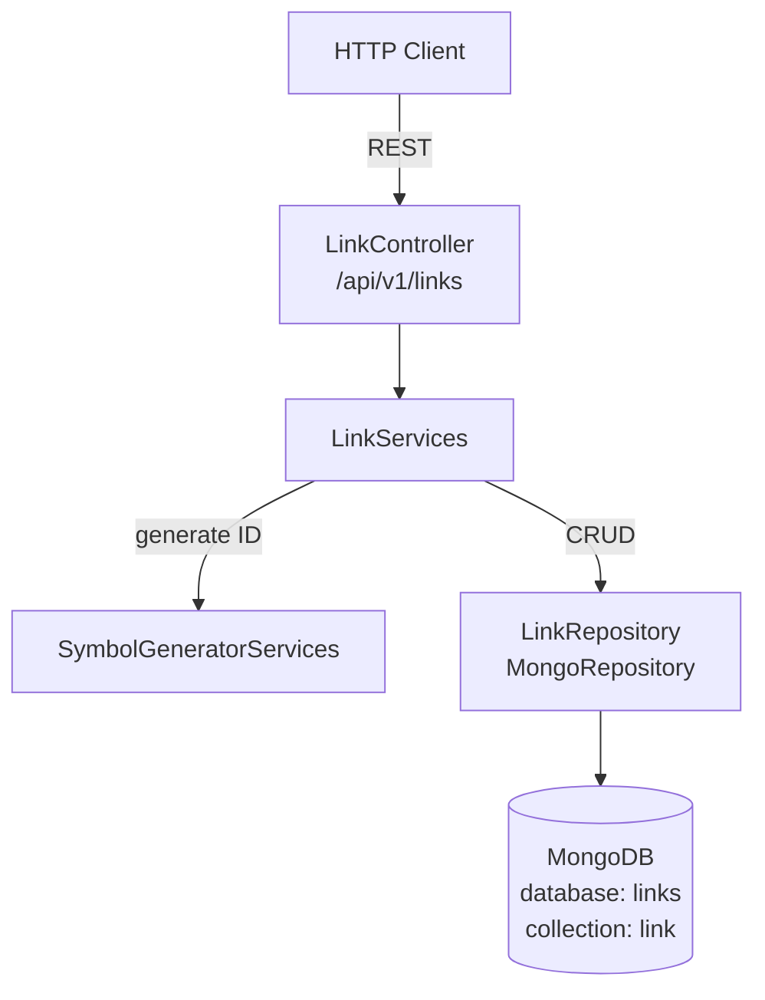
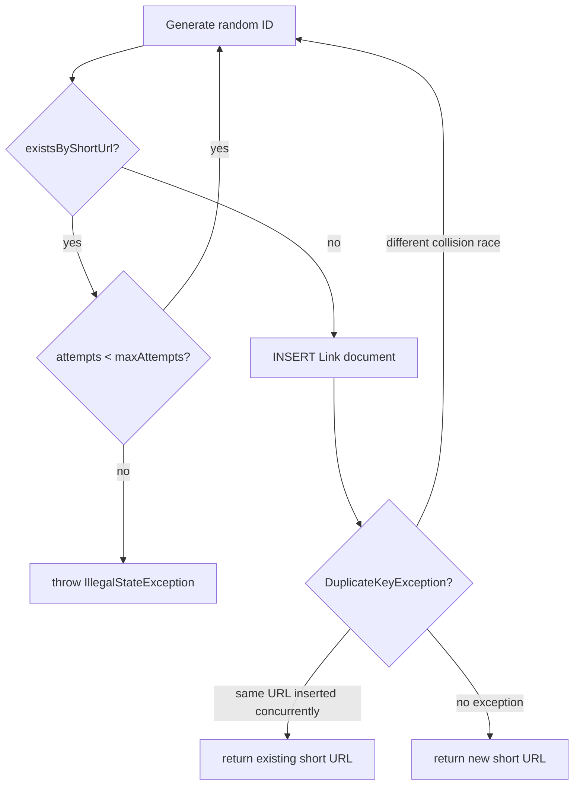

# Linker

A URL shortening service built with Spring Boot and MongoDB. Stores long URLs, generates
collision-safe short IDs, redirects users, and tracks redirect analytics.

**Stack:** Spring Boot, MongoDB, Swagger/OpenAPI

## Contents
1. [Quick Start](#1-quick-start)
2. [Architecture](#2-architecture)
3. [API Reference](#3-api-reference)
4. [Data Model](#4-data-model)
5. [Collision-safe ID Strategy](#5-collision-safe-id-strategy)
6. [Configuration](#6-configuration)
7. [Tests](#7-tests)

---

## 1. Quick Start

**Prerequisites:** MongoDB running on `localhost:27017`

```bash
mvn -pl linker spring-boot:run
```

| URL | Description |
|-----|-------------|
| http://localhost:8080/swagger-ui/index.html | Swagger UI |
| http://localhost:8080/v3/api-docs | OpenAPI JSON |

---

## 2. Architecture
<sub>[Back to top](#linker)</sub>



---

## 3. API Reference
<sub>[Back to top](#linker)</sub>

Base path: `/api/v1/links`

| Method | Path | Description | Success response |
|--------|------|-------------|------------------|
| `PUT` | `/` | Create or retrieve a short link | `200` plain-text short URL |
| `GET` | `/{shortUrl}` | Redirect to original URL | `302 Found` + `Location` header |
| `GET` | `/{shortUrl}/analytics` | Get redirect analytics | `200` `LinkAnalytics` JSON |
| `GET` | `/` | List all stored links | `200` `List<Link>` JSON |

---

### PUT /api/v1/links — Create Short Link

Request body: raw URL string (plain text or JSON string in Swagger).

```
https://example.org/very/long/path?with=params
```

Response: full short URL as plain text.

```
http://localhost:8080/api/v1/links/Ab12Cd
```

**Idempotent:** submitting the same URL a second time returns the existing short link — no
duplicates are stored in the database.

---

### GET /api/v1/links/{shortUrl} — Redirect

| Condition | Status |
|-----------|--------|
| Link found and not expired | `302 Found` + `Location` header pointing to original URL |
| Unknown short code | `404 Not Found` |
| Link past its expiration date | `410 Gone` |

---

### GET /api/v1/links/{shortUrl}/analytics — Analytics

Returns `404 Not Found` for an unknown short code, otherwise:

```json
{
  "shortUrl": "Ab12Cd",
  "url": "https://example.org/page",
  "creationDate": "2026-03-11T11:12:00.000+00:00",
  "expirationDate": "2026-04-10T11:12:00.000+00:00",
  "redirectCount": 3,
  "lastAccessDate": "2026-03-11T11:14:21.000+00:00",
  "expired": false
}
```

---

## 4. Data Model
<sub>[Back to top](#linker)</sub>

**`Link`** — MongoDB document stored in collection `link`.

| Field | Type | Description |
|-------|------|-------------|
| `id` | String | MongoDB ObjectId |
| `url` | String | Original long URL |
| `shortUrl` | String | Unique short code (unique index) |
| `creationDate` | Date | Creation timestamp |
| `expirationDate` | Date | Expiration timestamp |
| `redirectCount` | long | Number of successful redirects |
| `lastAccessDate` | Date | Timestamp of the most recent redirect |

---

## 5. Collision-safe ID Strategy
<sub>[Back to top](#linker)</sub>

Short codes are random alphanumeric strings (default: 6 characters, charset A–Z a–z 0–9).
The service handles both pre-insert collisions and concurrent-insert races:



- **Pre-insert check:** `existsByShortUrl()` detects known collisions before the write.
- **Unique index on `shortUrl`:** prevents duplicates at the database level.
- **Post-insert guard:** catches `DuplicateKeyException` for the concurrent-insert race:
  - If the same original URL was inserted by another request in parallel → return its short URL.
  - If a different collision happened → retry with a freshly generated ID.

---

## 6. Configuration
<sub>[Back to top](#linker)</sub>

`linker/src/main/resources/application.yaml`:

```yaml
host: http://localhost:8080/api/v1/links

linker:
  short-url:
    length: 6          # character length of each generated short code
    max-attempts: 64   # maximum retries before giving up with IllegalStateException
  expiration-days: 30  # days until a link expires (counted from creation)

spring:
  data:
    mongodb:
      database: links
      uri: mongodb://localhost:27017/?directConnection=true/links
```

---

## 7. Tests
<sub>[Back to top](#linker)</sub>

Run the full test suite for this module:

```bash
mvn -pl linker test
```

### Coverage summary

| Test class | Tests | Line coverage |
|------------|------:|--------------:|
| vfs-linker | 24 | 88.3% ✅ |

> [!TIP]
> `Application.java` (entry point) is excluded from meaningful coverage — it has only one line that starts the Spring context.

In-memory MongoDB is provided by `mongo-java-server` — no external MongoDB process is required for tests.
