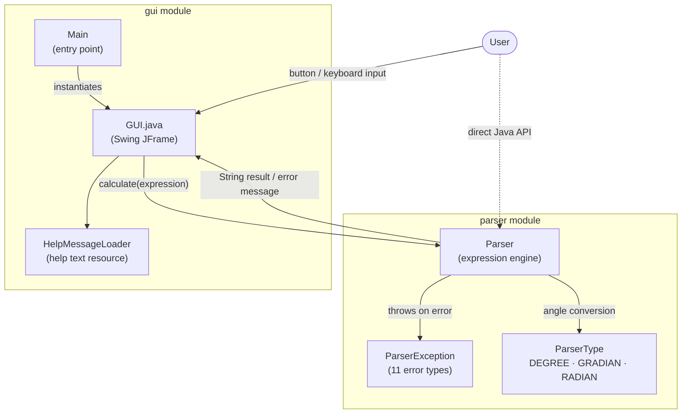
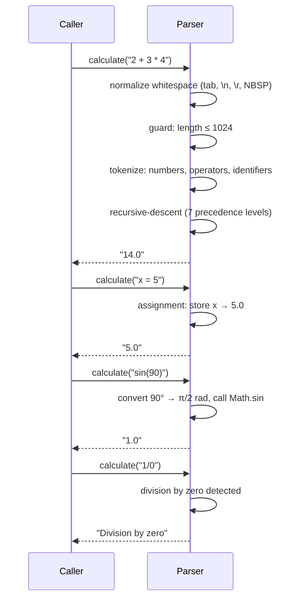

# MathParser

A top-down recursive-descent expression parser with a Swing desktop calculator UI.

Supports arithmetic, trig, logarithms, variables, and implicit multiplication out of the box.

**Stack:** Java, Swing (GUI module)

---

## Quick Start

**Prerequisites:** Java installed, Maven installed

### Run the desktop calculator

```bash
mvn clean -pl mathparser/gui -am -DskipTests package
java -jar mathparser/gui/target/mathparser.jar
```

### Use the parser as a library

```java
Parser parser = new Parser();             // default angle unit: DEGREE
parser.calculate("2 + 3 * 4")             // → "14.0"
parser.calculate("sin(90)")               // → "1.0"
parser.calculate("x = 5")                 // → "5.0"  (stores variable x)
parser.calculate("x * 2")                 // → "10.0"
parser.calculate("1 / 0")                 // → "Division by zero"
```

---

## Architecture



---

## Expression Syntax

### Operators

| Operator | Description | Example | Result |
|----------|-------------|---------|--------|
| `+` | Addition | `1 + 2 + 3` | `6.0` |
| `-` | Subtraction | `40 - 6 - 3` | `31.0` |
| `*` | Multiplication | `2 * 2 * 2 * 2` | `16.0` |
| `/` | Division | `64.0 / 2 / 4` | `8.0` |
| `%` | Modulo | `12 % 5` | `2.0` |
| `^` | Exponentiation | `2^10` | `1024.0` |

Operator precedence follows standard math rules: `^` > `* / %` > `+ -`. Use brackets to override.

### Constants

| Constant | Value |
|----------|-------|
| `e` | `Math.E` (≈ 2.71828…) |
| `pi` | `Math.PI` (≈ 3.14159…) |

### Implicit multiplication

The parser recognises juxtaposition as multiplication — no `*` operator needed:

| Expression | Parsed as | Result |
|-----------|-----------|--------|
| `2(3+4)` | `2 * (3+4)` | `14.0` |
| `2pi` | `2 * pi` | `6.283…` |
| `(2+3)(4+5)` | `(2+3) * (4+5)` | `45.0` |
| `3sin(90)` | `3 * sin(90)` | `3.0` |

---

## Functions Reference

### One-parameter functions

| Function | Description | Example | Result |
|----------|-------------|---------|--------|
| `abs(x)` | Absolute value | `abs(-100)` | `100.0` |
| `acos(x)` | Inverse cosine (result in current angle unit) | `acos(0)` | `90.0` *(degree)* |
| `asin(x)` | Inverse sine (result in current angle unit) | `asin(1)` | `90.0` *(degree)* |
| `atan(x)` | Inverse tangent (result in current angle unit) | `atan(1)` | `45.0` *(degree)* |
| `cbrt(x)` | Cube root (defined for negative arguments) | `cbrt(27)` | `3.0` |
| `ceil(x)` | Round toward +∞ | `ceil(1.2)` | `2.0` |
| `cos(x)` | Cosine (argument in current angle unit) | `cos(0)` | `1.0` |
| `exp(x)` | e^x | `exp(1)` | `2.718…` |
| `factorial(x)` | x! — non-negative integers, max input 12 | `factorial(5)` | `120.0` |
| `floor(x)` | Round toward −∞ | `floor(1.8)` | `1.0` |
| `ln(x)` | Natural logarithm | `ln(1)` | `0.0` |
| `log10(x)` | Base-10 logarithm | `round(log10(1000))` | `3.0` |
| `round(x)` | Round to nearest integer | `round(1.6)` | `2.0` |
| `sin(x)` | Sine (argument in current angle unit) | `sin(90)` | `1.0` |
| `sqrt(x)` | Square root | `sqrt(144)` | `12.0` |
| `tan(x)` | Tangent (argument in current angle unit) | `round(tan(45))` | `1.0` |

### Two-parameter functions

| Function | Description | Example | Result |
|----------|-------------|---------|--------|
| `pow(base, exp)` | base^exp | `pow(2, 10)` | `1024.0` |
| `log(base, value)` | Logarithm with explicit base | `round(log(10, 1000))` | `3.0` |

### Multi-parameter functions

Accept any number of comma-separated arguments (≥ 1).

| Function | Description | Example | Result |
|----------|-------------|---------|--------|
| `min(a, b, …)` | Minimum value | `min(2, 3, 5)` | `2.0` |
| `max(a, b, …)` | Maximum value | `max(2, 3, 5)` | `5.0` |
| `sum(a, b, …)` | Sum of all values | `sum(30, 60, 90)` | `180.0` |
| `avg(a, b, …)` | Arithmetic mean | `avg(3, 6, 9)` | `6.0` |

---

## Variables

Variables are assigned and looked up within the **same `Parser` instance**. The assignment
expression itself returns the assigned value as a `String`.

```java
parser.calculate("x = 10");   // → "10.0"
parser.calculate("x * 2");    // → "20.0"

parser.calculate("a = 3");
parser.calculate("b = 4");
parser.calculate("a + b");    // → "7.0"
```

- Variable names are identifier strings (letters/digits), max 32 characters.
- Re-assigning a variable overwrites the previous value.
- Variables are **not** shared between separate `Parser` instances.
- Using an undefined variable returns `"Unknown variable"`.

---

## Angle Units

Trigonometric and inverse-trigonometric functions use the angle unit configured on the
`Parser` instance. The default is **DEGREE**.

| Unit | Constant | One full rotation |
|------|----------|-------------------|
| Degree | `ParserType.DEGREE` | 360° |
| Gradian | `ParserType.GRADIAN` | 400 grad |
| Radian | `ParserType.RADIAN` | 2π rad |

```java
// Set unit via constructor
Parser parser = new Parser(ParserType.RADIAN);
parser.calculate("asin(1)");          // → "1.5707963267948966"  (π/2)

// Switch unit at runtime
parser.setTangentUnit(ParserType.GRADIAN);
parser.calculate("sin(100)");         // → "1.0"  (100 grad = 90°)
```

> **Note:** `setTangentUnit(null)` throws `NullPointerException`.

---

## Evaluation Flow



The seven precedence levels, from lowest to highest:

| Level | Handles |
|-------|---------|
| 1 | Variable assignment (`=`) |
| 2 | Addition / subtraction (`+`, `-`) |
| 3 | Multiplication / division / modulo (`*`, `/`, `%`) + implicit multiplication |
| 4 | Exponentiation (`^`, right-associative) |
| 5 | Unary operators (`+`, `-`) |
| 6 | Brackets and function calls |
| 7 | Atoms: numbers, constants (`e`, `pi`), variables |

---

## Parser API

```java
// Constructors
Parser parser = new Parser();                      // angle unit: DEGREE
Parser parser = new Parser(ParserType.RADIAN);     // explicit angle unit

// Evaluate expression — thread-safe (synchronized)
String result = parser.calculate(String expression);

// Change angle unit at runtime — thread-safe (synchronized)
parser.setTangentUnit(ParserType unit);            // null → NullPointerException
```

`calculate()` never throws. On error it returns the human-readable message from `ParserException`.
Function names are matched case-insensitively using `Locale.ROOT` to avoid Turkish-I issues.

---

## Limits

| Limit | Value | Error returned |
|-------|-------|----------------|
| Max expression length | 1 024 characters | `"Expression is too big (max '1024' characters)"` |
| Max identifier length | 32 characters | `"Identifier is too long (max '32' characters)"` |
| Max `factorial` input | 12 | `"Numeric overflow."` |
| `factorial` input domain | Non-negative integers only | `"Factorial requires non-negative integers."` |

---

## Error Reference

All errors are members of `ParserException.Error`. `calculate()` returns the corresponding
message string when an error is detected.

| Error constant | Message returned | Caused by |
|----------------|-----------------|-----------|
| `SYNTAX` | `Syntax error` | Double decimal (`1..2`), trailing operator, wrong function arity |
| `UNBAL_PARENTS` | `Unbalanced brackets` | Unclosed `(` or extra `)` |
| `NO_EXPRESSION` | `Expression wasn't found` | Empty or whitespace-only input |
| `DIVISION_BY_ZERO` | `Division by zero` | `x / 0` or `x % 0` |
| `UNKNOWN_EXPRESSION` | `Unknown expression` | Illegal character (`#`, `@`, `.2`, …) |
| `UNKNOWN_FUNCTION` | `Unknown function` | Name not in the supported function set |
| `UNKNOWN_VARIABLE` | `Unknown variable` | Variable used before it was assigned |
| `TOO_BIG` | `Expression is too big (max '1024' characters)` | Input longer than 1 024 characters |
| `IDENTIFIER_TOO_LONG` | `Identifier is too long (max '32' characters)` | Variable or function name > 32 characters |
| `NON_NEGATIVE_INTEGERS` | `Factorial requires non-negative integers.` | `factorial(-1)` or `factorial(0.5)` |
| `NUMERIC_OVERFLOW` | `Numeric overflow.` | `factorial(13)` or higher |

---

## Tests

Run all parser tests:

```bash
mvn -pl mathparser/parser test
```

Compile GUI tests (real Swing windows — unstable in headless/macOS CI environments):

```bash
mvn -pl mathparser/gui test-compile
```

| Test class | Type | Covers |
|------------|------|--------|
| `ParserTest` | Unit | 87 tests — addition, subtraction, multiplication, division, modulo, exponentiation, combinations (precedence, brackets, implicit multiplication, constants), variables, all one/two/multi-param functions across all angle modes, whitespace normalization, locale safety |
| `ParserExceptionTest` | Unit | 44 tests — all 11 `ParserException.Error` constants with multiple edge cases each, organised by enum declaration order |
| `GUITest` | Unit (Swing) | 8 tests — calculate button, clear, backspace, history save, angle-unit radio toggle, "More" panel toggle, help dialog, error display |
| `HelpMessageLoaderTest` | Unit | Help text resource loading from classpath and fallback for missing resource |
