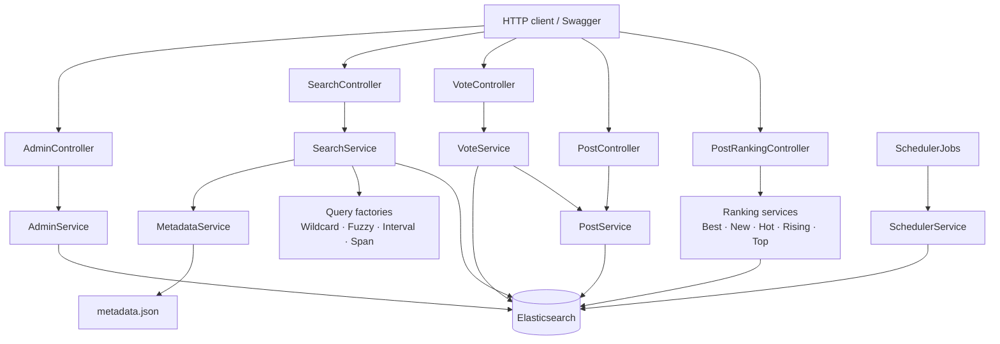
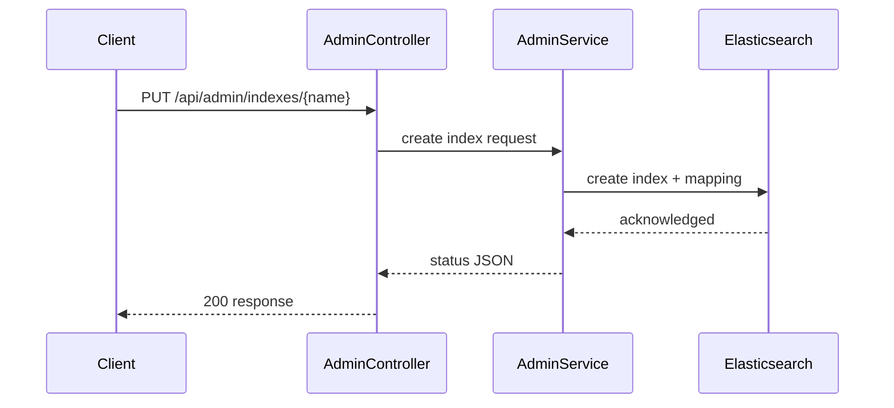
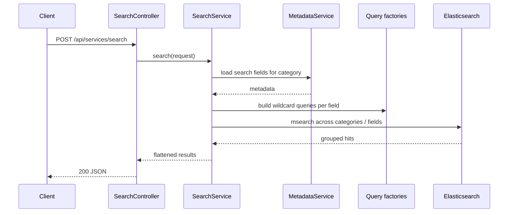
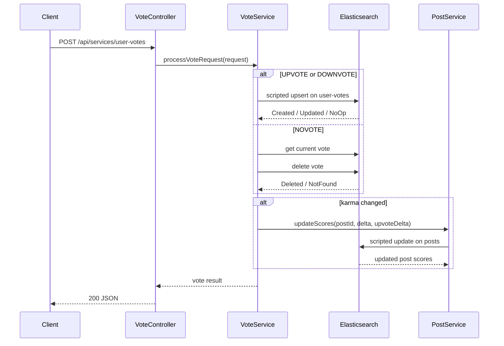
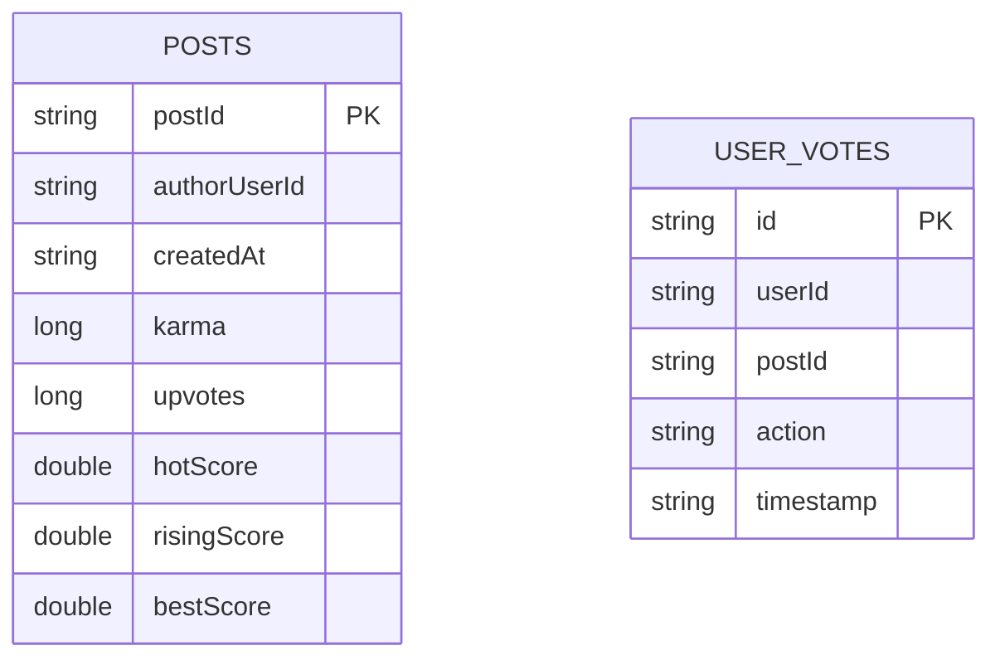

# ESS Architecture

[Back to ESS](README.md)

## Contents
1. [Goal](#1-goal)
2. [Runtime Topology](#2-runtime-topology)
3. [Module Structure](#3-module-structure)
4. [Request Flows](#4-request-flows)
5. [Index and Data Model](#5-index-and-data-model)
6. [Local Infrastructure](#6-local-infrastructure)
7. [Testing Strategy](#7-testing-strategy)
8. [Current Tradeoffs](#8-current-tradeoffs)

## 1. Goal
[Back to top](#ess-architecture)

`ess` packages a small Elasticsearch-centered system with two related concerns:

- search across several content indexes using multiple query styles
- a post/vote/ranking workflow that keeps ranking fields denormalized inside the `posts` index

The architecture intentionally stays simple:

- controllers handle HTTP mapping and validation
- services own Elasticsearch reads, writes, scoring, and orchestration
- configuration classes build the Elasticsearch client, retry behavior, security, and scheduling

## 2. Runtime Topology
[Back to top](#ess-architecture)

Runtime notes:

- all persistence and search operations go through Elasticsearch
- `metadata.json` controls which fields are searched for each content category
- `VoteService` updates the `user-votes` index and then delegates score recomputation to `PostService`
- ranking endpoints read precomputed scores from `posts`, rather than aggregating votes on every request

## 3. Module Structure
[Back to top](#ess-architecture)

| Module / area | Responsibility |
|---|---|
| `ess-api` | shared request/response models, enums, validation, API constants |
| `ess-app.controller` | HTTP endpoints for admin, search, posts, votes, and rankings |
| `ess-app.service` | business logic, Elasticsearch orchestration, metadata loading, scheduler cleanup |
| `ess-app.service.query` | query builders for wildcard, fuzzy, interval, and span searches |
| `ess-app.service.ranking` | read-side ranking queries over the `posts` index |
| `ess-app.config` | Elasticsearch client creation, retry/backoff transport, security, scheduler defaults |
| `ess-testing` | Cucumber scenarios, downloader support, and Testcontainers-based integration coverage |

Key classes:

| Class | Purpose |
|---|---|
| `AdminController` / `AdminService` | creates the indexes used by the rest of the module |
| `SearchController` / `SearchService` | executes general and query-specific search requests |
| `MetadataService` | loads search-field metadata from `metadata.json` |
| `VoteController` / `VoteService` | writes one vote document per user/post pair and keeps post scores in sync |
| `PostController` / `PostService` | inserts new posts and updates denormalized ranking fields |
| `PostRankingController` | exposes read-only ranked feeds |
| `SchedulerJobs` / `SchedulerService` | deletes old `user-votes` documents on a schedule |
| `RetryingElasticsearchTransport` | wraps the Elasticsearch transport with timeout and retry behavior |

## 4. Request Flows
[Back to top](#ess-architecture)

### Create indexes

### Search request

The dedicated `/wildcard`, `/fuzzy`, `/interval`, and `/span` endpoints follow the same controller-to-service flow, but each uses one query factory rather than the generic `msearch` fan-out path.

### Vote and ranking update

Ranking reads are intentionally cheap:

- `new` sorts by `createdAt`
- `top` sorts by `karma`
- `top/{window}` applies a time filter first, then sorts by `karma`
- `hot`, `rising`, and `best` sort by precomputed score fields in `posts`

## 5. Index and Data Model
[Back to top](#ess-architecture)

The module uses seven indexes:

- `books`
- `companies`
- `movies`
- `music`
- `people`
- `posts`
- `user-votes`

Search model:

- content indexes are searched using metadata-defined field lists
- metadata comes from `ess-app/src/main/resources/metadata.json`
- the generic search endpoint can search all content categories when the requested category is `ALL` or when no exact metadata entry is found

Post and vote model:

Field notes:

- `posts` stores denormalized ranking fields so ranking reads stay simple
- `user-votes` stores one document per `(userId, postId)` pair
- vote changes are applied with Elasticsearch scripts so the state transition and score updates stay atomic per write
- post IDs are generated server-side as 6-character alphanumeric strings

## 6. Local Infrastructure
[Back to top](#ess-architecture)

The repo-local stack is defined in [compose.yaml](compose.yaml).

It brings up:

- Elasticsearch
- a one-shot password bootstrap container for `kibana_system`
- Kibana

Default local characteristics:

- Elasticsearch image: `docker.elastic.co/elasticsearch/elasticsearch:9.3.1-arm64`
- Kibana image: `docker.elastic.co/kibana/kibana:9.3.1-arm64`
- ports:
  - `9200` for Elasticsearch
  - `5601` for Kibana
- security enabled
- HTTP SSL disabled between the app and local Elasticsearch
- stable named Docker volumes for both Elasticsearch and Kibana state

Application-side Elasticsearch access is configured in `ess-app` with:

- explicit connect, socket, and request timeouts
- retry/backoff for transport-level I/O failures
- optional SSL support through configuration, even though the checked-in local compose setup keeps HTTP SSL off

## 7. Testing Strategy
[Back to top](#ess-architecture)

Testing is intentionally split by layer:

- `ess-api`
  - model, enum, validation, and constant tests
- `ess-app`
  - controller, service, scheduler, and configuration tests
- `ess-testing`
  - Cucumber scenarios and downloader-oriented tests
  - Testcontainers-backed Elasticsearch integration coverage

This keeps fast unit-style coverage close to the code while still supporting realistic end-to-end Elasticsearch checks in the dedicated testing module.

## 8. Current Tradeoffs
[Back to top](#ess-architecture)

- security is permissive right now: all HTTP endpoints are anonymous, which is convenient for demos but not production-ready
- search endpoints intentionally expose expensive query styles such as wildcard and fuzzy queries for experimentation and comparison
- ranking data is denormalized into `posts`, which keeps reads fast but pushes more work into the vote-write path
- cleanup currently only targets the `user-votes` index and is based on document age
- the checked-in compose file defaults to ARM64 Elastic images, so x86 developers may need to override `ES_LOCAL_VERSION`
