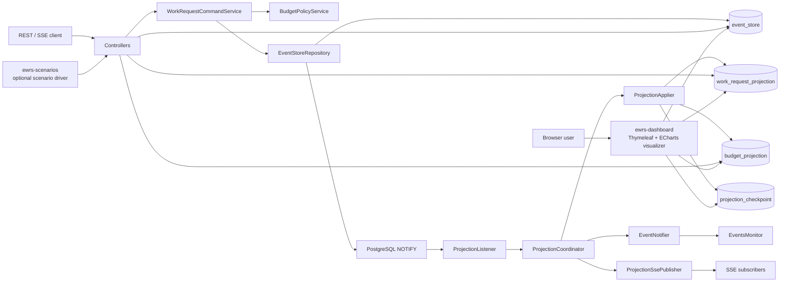
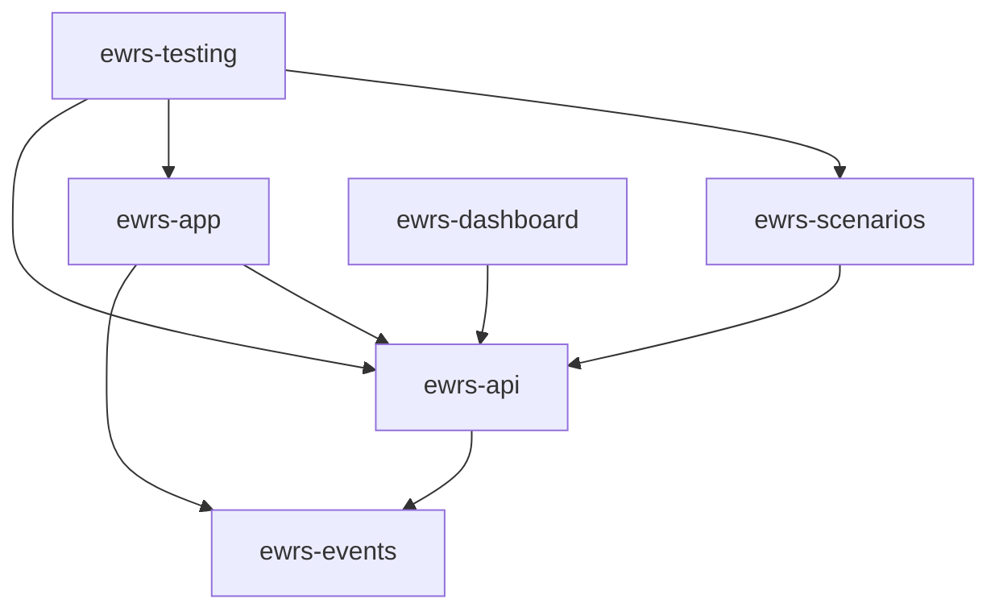
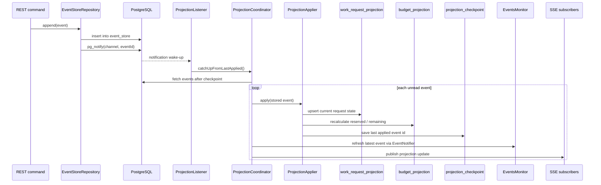

# EWRS Architecture

[Back to EWRS](README.md)

See also [SCHEMA.md](SCHEMA.md) for the table-by-table SQL schema reference.

## Contents
1. [Goal](#1-goal)
2. [Runtime Topology](#2-runtime-topology)
3. [Module Map](#3-module-map)
4. [Write Side](#4-write-side)
5. [Read Side](#5-read-side)
6. [Projection Flow](#6-projection-flow)
7. [Why JDBC and Native SQL](#7-why-jdbc-and-native-sql)
8. [Package Map](#8-package-map)
9. [Testing Strategy](#9-testing-strategy)
10. [Current Tradeoffs](#10-current-tradeoffs)

## 1. Goal
[Back to top](#ewrs-architecture)

`ewrs` is a compact event-sourced work request service.

Its core rules are:

- commands append facts to an append-only `event_store`
- current state is rebuilt from ordered event history
- read-side projections are derived asynchronously
- in-memory `EventsMonitor` is a cache, not the source of truth

The rebuild keeps the original event kernel and event family while replacing the old simulator runtime
with a Spring Boot + PostgreSQL service.

Around that core runtime, `ewrs-scenarios` acts as an optional standalone driver that generates deterministic
workflows and mixed load by calling the public EWRS HTTP API.

`ewrs-dashboard` is the optional standalone visualization layer that reads the SQL read side and event history
directly to render a browser dashboard with Thymeleaf and ECharts.

## 2. Runtime Topology
[Back to top](#ewrs-architecture)

## 3. Module Map
[Back to top](#ewrs-architecture)

| Module | ArtifactId | Responsibility                                                                                                           | Depends on |
|---|---|--------------------------------------------------------------------------------------------------------------------------|---|
| `ewrs/events` | `ewrs-events` | event contracts, event types, notifier, listener registry, in-memory latest-event monitor                                | Spring context, SLF4J API |
| `ewrs/api` | `ewrs-api` | REST and SSE DTO contracts                                                                                               | `ewrs-events`, Jakarta Validation |
| `ewrs/app` | `ewrs-app` | Spring Boot runtime, event store, command logic, projections, replay, SSE, OpenAPI                                       | `ewrs-api`, `ewrs-events`, Spring Boot, Liquibase, PostgreSQL |
| `ewrs/scenarios` | `ewrs-scenarios` | standalone scenario/load driver that calls `ewrs-app` over HTTP for deterministic flows and seeded demo data             | `ewrs-api`, Spring Boot, SpringDoc |
| `ewrs/dashboard` | `ewrs-dashboard` | standalone read-only visualizer over EWRS projections and event history with Thymeleaf + ECharts                         | `ewrs-api`, Spring Boot, Thymeleaf, PostgreSQL |
| `ewrs/testing` | `ewrs-testing` | Testcontainers PostgreSQL, Cucumber scenarios, live projection/SSE verification through the scenario driver and core API | `ewrs-app`, `ewrs-api`, `ewrs-scenarios`, Spring Boot Test, Cucumber |

`ewrs-scenarios` reaches `ewrs-app` at runtime through HTTP, not through a direct code dependency on the app module.
`ewrs-dashboard` reaches EWRS state at runtime through the shared PostgreSQL read tables and `event_store`, not
through the command API.

## 4. Write Side
[Back to top](#ewrs-architecture)

The write model is explicit and transition-driven.

Valid command outcomes:

1. `CREATE`
   appends `CreatedEvent`
2. `APPROVE`
   appends `AcceptedEvent` when the budget policy passes
3. `APPROVE` with insufficient budget
   appends `RejectedEvent` with a policy reason
4. `REJECT`
   appends `RejectedEvent` with an operator reason
5. `START`
   appends `RunningEvent`
6. `COMPLETE`
   appends `CompletedEvent`

Invalid transitions append nothing and return a conflict-style response.

The authoritative event store shape is:

- `id`
- `event_id`
- `task_id`
- `stream_version`
- `event_type`
- `status`
- `payload jsonb`
- `metadata jsonb`
- `occurred_at`

`(task_id, stream_version)` is unique to preserve optimistic ordering.

## 5. Read Side
[Back to top](#ewrs-architecture)

The read side is the query-facing model derived from event history.

It is intentionally separate from the write side:

- commands append immutable facts to `event_store`
- queries read current state from projections instead of re-running domain transitions on every request
- the timeline endpoint reads ordered history directly from `event_store`

The main read models are:

- `work_request_projection`
  current state of each work request, including latest status, actor, reason, and stream version
- `budget_projection`
  current reserved and remaining budget per budget code
- `EventsMonitor`
  in-memory latest-event cache for demo visibility and fan-out, not a durable read model

Read-side behavior follows a CQRS-style contract:

- `GET /api/v1/work-requests/{requestId}` reads the current projected request state
- `GET /api/v1/work-requests` reads the projected request list with filters
- `GET /api/v1/projections/budgets` reads the projected budget view
- `GET /api/v1/work-requests/{requestId}/timeline` reads ordered event history from the event store
- `GET /api/v1/projections/stream` emits projection updates over SSE
- `ewrs-dashboard` visualizes those same read models directly from SQL for browser users and demo sessions

Important read-side rules:

- the read side is eventually consistent with the write side
- projections can always be rebuilt from the append-only event log
- read models are disposable and reproducible; event history is the source of truth
- SSE publishes projection updates, not raw event-store rows

## 6. Projection Flow
[Back to top](#ewrs-architecture)

Important projection rules:

- `LISTEN/NOTIFY` is only a wake-up signal
- projector recovery always starts from the saved checkpoint
- timeline reads come directly from `event_store`
- admin rebuild truncates and replays projections but never rewrites event history

## 7. Why JDBC and Native SQL
[Back to top](#ewrs-architecture)

EWRS intentionally uses JDBC with explicit SQL as its persistence style.

This is not an accidental low-level implementation choice. It follows directly from the architecture:

- the source of truth is an append-only event log, not a mutable aggregate table
- event rows contain `payload jsonb` and `metadata jsonb`, which are persisted and queried as PostgreSQL-native structures
- projections are maintained with explicit SQL upserts and recalculations
- projector wake-up uses PostgreSQL `LISTEN/NOTIFY`
- replay and catch-up depend on strict ordering by stored event id and stream version

JPA is a poor fit here for structural reasons:

- EWRS does not manage a rich entity graph with lazy relations, cascades, or dirty checking
- the main write operation is `insert one immutable event row`, not `load entity -> mutate entity -> flush`
- timeline and replay queries are log-oriented and order-sensitive rather than entity-oriented
- budget evaluation reads the latest event per task and inspects JSON payload fields
- projection rebuilds intentionally execute database-shaped operations such as `insert ... on conflict do update`

Using JDBC keeps those mechanics explicit and honest:

- the SQL that defines projection behavior is visible in the repository layer instead of hidden behind ORM translation
- PostgreSQL-specific features such as `jsonb`, `pg_notify`, `distinct on`, and conflict-upsert syntax can be used directly
- replay logic is easier to reason about because row ordering, checkpoint reads, and batch fetches are controlled explicitly
- the code maps closely to the event-sourcing model: append facts, read ordered history, rebuild projections

Using JPA here would add framework machinery without solving the core problems of this module:

- entity state management would not replace the need for native SQL against the event store
- projection maintenance would still need handcrafted SQL for correctness and performance
- PostgreSQL notification handling would still sit outside the ORM model
- the real business invariants live in event ordering and projection application, not in entity lifecycle callbacks

In short:

- if EWRS were centered on CRUD-style domain entities, JPA would be a reasonable default
- because EWRS is centered on an append-only event store, replay, SQL projections, and PostgreSQL-native features, JDBC and native SQL are the clearer and more appropriate choice

## 8. Package Map
[Back to top](#ewrs-architecture)

### `ewrs-events`

| Package | Responsibility |
|---|---|
| `dev.nklip.javacraft.ewrs.events` | event contracts, statuses, priorities, notifier, monitor, subscription manager |
| `dev.nklip.javacraft.ewrs.events.impl` | concrete workflow events and Spring adapter implementation |

### `ewrs-api`

| Package | Responsibility |
|---|---|
| `dev.nklip.javacraft.ewrs.api.command` | command request DTOs |
| `dev.nklip.javacraft.ewrs.api.query` | query/SSE/rebuild response DTOs |
| `dev.nklip.javacraft.ewrs.api.shared` | shared API error model |

### `ewrs-app`

| Package | Responsibility |
|---|---|
| `dev.nklip.javacraft.ewrs.app.config` | startup configuration for the shared clock and OpenAPI metadata |
| `dev.nklip.javacraft.ewrs.app.controller` | HTTP endpoints for commands, queries, budgets, rebuild, and SSE plus exception mapping |
| `dev.nklip.javacraft.ewrs.app.exception` | application-level transition, lookup, and budget exceptions |
| `dev.nklip.javacraft.ewrs.app.model` | event-store and aggregate models used by repositories and services |
| `dev.nklip.javacraft.ewrs.app.repository` | explicit JDBC repositories for the append-only event store and SQL projections |
| `dev.nklip.javacraft.ewrs.app.service` | command rules, budget policy, projection catch-up, rebuild flow, queries, and SSE publication |

### `ewrs-scenarios`

| Package | Responsibility                                                            |
|---|---------------------------------------------------------------------------|
| `dev.nklip.javacraft.ewrs.scenarios.api` | scenario/load request-response contracts and scenario catalog enum        |
| `dev.nklip.javacraft.ewrs.scenarios.client` | HTTP gateway into `ewrs-app` using the public EWRS API                    |
| `dev.nklip.javacraft.ewrs.scenarios.config` | target URL, timeout, clock, and OpenAPI configuration                     |
| `dev.nklip.javacraft.ewrs.scenarios.controller` | HTTP endpoints for scenario generation plus driver-specific error mapping |
| `dev.nklip.javacraft.ewrs.scenarios.exception` | scenario orchestration failures and target-call problems                  |
| `dev.nklip.javacraft.ewrs.scenarios.service` | deterministic scenario catalog and execution logic                        |

### `ewrs-dashboard`

| Package | Responsibility |
|---|---|
| `dev.nklip.javacraft.ewrs.dashboard.api` | dashboard-specific chart, summary, and projection-health DTOs |
| `dev.nklip.javacraft.ewrs.dashboard.config` | OpenAPI metadata for the read-only dashboard JSON layer |
| `dev.nklip.javacraft.ewrs.dashboard.controller` | Thymeleaf page rendering, dashboard JSON endpoints, and shared error mapping |
| `dev.nklip.javacraft.ewrs.dashboard.exception` | dashboard-specific read-side lookup failures |
| `dev.nklip.javacraft.ewrs.dashboard.repository` | explicit JDBC/native-SQL dashboard queries over projections, checkpoint, and event history |
| `dev.nklip.javacraft.ewrs.dashboard.service` | aggregation of raw SQL reads into UI-facing overview and timeline responses |

### `ewrs-testing`

| Package | Responsibility |
|---|---|
| `dev.nklip.javacraft.ewrs.testing` | composite test application plus live LISTEN/NOTIFY and SSE integration tests |
| `dev.nklip.javacraft.ewrs.testing.cucumber` | end-to-end feature runner and steps that call the scenario driver over HTTP |
| `dev.nklip.javacraft.ewrs.testing.cucumber.config` | shared PostgreSQL test container bootstrap |

## 9. Testing Strategy
[Back to top](#ewrs-architecture)

Testing follows the module boundaries:

- `ewrs-events`
  metadata-bearing event behavior, identity, fan-out, and monitor state
- `ewrs-app`
  command transitions, event append rules, replay idempotence, rebuild correctness, and projection catch-up
- `ewrs-scenarios`
  deterministic scenario sequencing, target HTTP calls, projection waiting, and mixed-load generation
- `ewrs-dashboard`
  dashboard SQL aggregation, request timeline drill-down, and standalone page/API rendering against PostgreSQL
- `ewrs-testing`
  HTTP happy paths, denial/rejection flows, invalid transitions, rebuild via API, live projection wake-up, and SSE delivery through the same scenario-driver surface used outside tests

## 10. Current Tradeoffs
[Back to top](#ewrs-architecture)

- projections are eventually consistent with the command side
- the service uses PostgreSQL `LISTEN/NOTIFY` as wake-up only, not as a durable queue
- `EventsMonitor` stores only the latest event per task, not the full history
- `ewrs-scenarios` is a driver, not a source of truth; if `ewrs-app` is unavailable, scenario execution fails with a gateway-style error
- `ewrs-dashboard` is read-only and depends on the shared EWRS schema already existing; it does not own migrations
- the dashboard loads ECharts from a CDN at page-render time to keep the module lightweight
- runtime scope is intentionally PostgreSQL-only; Debezium is still deferred
