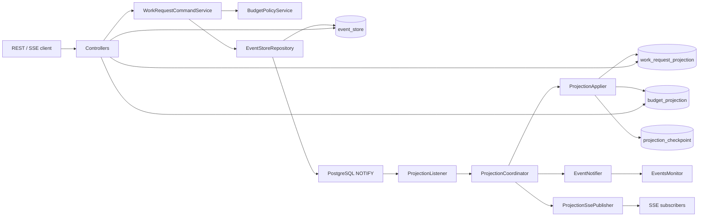
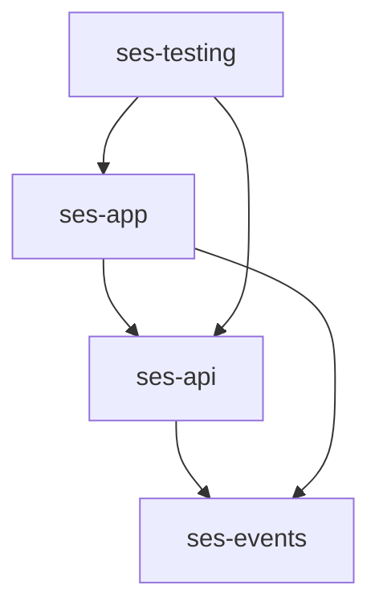
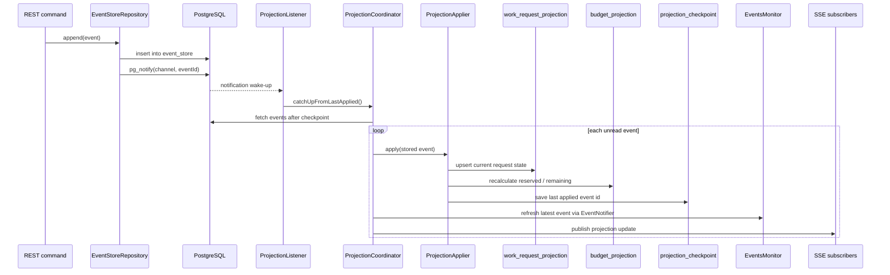

# SES Architecture

[Back to SES](README.md)

## Contents
1. [Goal](#1-goal)
2. [Runtime Topology](#2-runtime-topology)
3. [Module Map](#3-module-map)
4. [Write Side](#4-write-side)
5. [Read Side](#5-read-side)
6. [Projection Flow](#6-projection-flow)
7. [Why JDBC and Native SQL](#7-why-jdbc-and-native-sql)
8. [Package Map](#8-package-map)
9. [Testing Strategy](#9-testing-strategy)
10. [Current Tradeoffs](#10-current-tradeoffs)

## 1. Goal
[Back to top](#ses-architecture)

`ses` is a compact event-sourced work request service.

Its core rules are:

- commands append facts to an append-only `event_store`
- current state is rebuilt from ordered event history
- read-side projections are derived asynchronously
- in-memory `EventsMonitor` is a cache, not the source of truth

The rebuild keeps the original event kernel and event family while replacing the old simulator runtime
with a Spring Boot + PostgreSQL service.

## 2. Runtime Topology
[Back to top](#ses-architecture)

## 3. Module Map
[Back to top](#ses-architecture)

| Module | ArtifactId | Responsibility | Depends on |
|---|---|---|---|
| `ses/events` | `ses-events` | event contracts, event types, notifier, listener registry, in-memory latest-event monitor | Spring context, SLF4J API |
| `ses/api` | `ses-api` | REST and SSE DTO contracts | `ses-events`, Jakarta Validation |
| `ses/app` | `ses-app` | Spring Boot runtime, event store, command logic, projections, replay, SSE, OpenAPI | `ses-api`, `ses-events`, Spring Boot, Liquibase, PostgreSQL |
| `ses/testing` | `ses-testing` | Testcontainers PostgreSQL, Cucumber scenarios, live projection/SSE verification | `ses-app`, `ses-api`, Spring Boot Test, Cucumber |

## 4. Write Side
[Back to top](#ses-architecture)

The write model is explicit and transition-driven.

Valid command outcomes:

1. `CREATE`
   appends `CreatedEvent`
2. `APPROVE`
   appends `AcceptedEvent` when the budget policy passes
3. `APPROVE` with insufficient budget
   appends `RejectedEvent` with a policy reason
4. `REJECT`
   appends `RejectedEvent` with an operator reason
5. `START`
   appends `RunningEvent`
6. `COMPLETE`
   appends `CompletedEvent`

Invalid transitions append nothing and return a conflict-style response.

The authoritative event store shape is:

- `id`
- `event_id`
- `task_id`
- `stream_version`
- `event_type`
- `status`
- `payload jsonb`
- `metadata jsonb`
- `occurred_at`

`(task_id, stream_version)` is unique to preserve optimistic ordering.

## 5. Read Side
[Back to top](#ses-architecture)

The read side is the query-facing model derived from event history.

It is intentionally separate from the write side:

- commands append immutable facts to `event_store`
- queries read current state from projections instead of re-running domain transitions on every request
- the timeline endpoint reads ordered history directly from `event_store`

The main read models are:

- `work_request_projection`
  current state of each work request, including latest status, actor, reason, and stream version
- `budget_projection`
  current reserved and remaining budget per budget code
- `EventsMonitor`
  in-memory latest-event cache for demo visibility and fan-out, not a durable read model

Read-side behavior follows a CQRS-style contract:

- `GET /api/v1/work-requests/{requestId}` reads the current projected request state
- `GET /api/v1/work-requests` reads the projected request list with filters
- `GET /api/v1/projections/budgets` reads the projected budget view
- `GET /api/v1/work-requests/{requestId}/timeline` reads ordered event history from the event store
- `GET /api/v1/projections/stream` emits projection updates over SSE

Important read-side rules:

- the read side is eventually consistent with the write side
- projections can always be rebuilt from the append-only event log
- read models are disposable and reproducible; event history is the source of truth
- SSE publishes projection updates, not raw event-store rows

## 6. Projection Flow
[Back to top](#ses-architecture)

Important projection rules:

- `LISTEN/NOTIFY` is only a wake-up signal
- projector recovery always starts from the saved checkpoint
- timeline reads come directly from `event_store`
- admin rebuild truncates and replays projections but never rewrites event history

## 7. Why JDBC and Native SQL
[Back to top](#ses-architecture)

SES intentionally uses JDBC with explicit SQL as its persistence style.

This is not an accidental low-level implementation choice. It follows directly from the architecture:

- the source of truth is an append-only event log, not a mutable aggregate table
- event rows contain `payload jsonb` and `metadata jsonb`, which are persisted and queried as PostgreSQL-native structures
- projections are maintained with explicit SQL upserts and recalculations
- projector wake-up uses PostgreSQL `LISTEN/NOTIFY`
- replay and catch-up depend on strict ordering by stored event id and stream version

JPA is a poor fit here for structural reasons:

- SES does not manage a rich entity graph with lazy relations, cascades, or dirty checking
- the main write operation is `insert one immutable event row`, not `load entity -> mutate entity -> flush`
- timeline and replay queries are log-oriented and order-sensitive rather than entity-oriented
- budget evaluation reads the latest event per task and inspects JSON payload fields
- projection rebuilds intentionally execute database-shaped operations such as `insert ... on conflict do update`

Using JDBC keeps those mechanics explicit and honest:

- the SQL that defines projection behavior is visible in the repository layer instead of hidden behind ORM translation
- PostgreSQL-specific features such as `jsonb`, `pg_notify`, `distinct on`, and conflict-upsert syntax can be used directly
- replay logic is easier to reason about because row ordering, checkpoint reads, and batch fetches are controlled explicitly
- the code maps closely to the event-sourcing model: append facts, read ordered history, rebuild projections

Using JPA here would add framework machinery without solving the core problems of this module:

- entity state management would not replace the need for native SQL against the event store
- projection maintenance would still need handcrafted SQL for correctness and performance
- PostgreSQL notification handling would still sit outside the ORM model
- the real business invariants live in event ordering and projection application, not in entity lifecycle callbacks

In short:

- if SES were centered on CRUD-style domain entities, JPA would be a reasonable default
- because SES is centered on an append-only event store, replay, SQL projections, and PostgreSQL-native features, JDBC and native SQL are the clearer and more appropriate choice

## 8. Package Map
[Back to top](#ses-architecture)

### `ses-events`

| Package | Responsibility |
|---|---|
| `dev.nklip.javacraft.ses.events` | event contracts, statuses, priorities, notifier, monitor, subscription manager |
| `dev.nklip.javacraft.ses.events.impl` | concrete workflow events and Spring adapter implementation |

### `ses-api`

| Package | Responsibility |
|---|---|
| `dev.nklip.javacraft.ses.api.command` | command request DTOs |
| `dev.nklip.javacraft.ses.api.query` | query/SSE/rebuild response DTOs |
| `dev.nklip.javacraft.ses.api.shared` | shared API error model |

### `ses-app`

| Package | Responsibility |
|---|---|
| `dev.nklip.javacraft.ses.app.controller` | HTTP endpoints for commands, queries, budgets, rebuild, and SSE |
| `dev.nklip.javacraft.ses.app.domain` | command-side rules and budget policy |
| `dev.nklip.javacraft.ses.app.projection` | projection repositories and catch-up / rebuild orchestration |
| `dev.nklip.javacraft.ses.app.query` | query-side services over projections and timeline history |
| `dev.nklip.javacraft.ses.app.sse` | live projection stream fan-out |
| `dev.nklip.javacraft.ses.app.store` | append-only event store access and event serialization |
| `dev.nklip.javacraft.ses.app.web` | REST exception mapping |

### `ses-testing`

| Package | Responsibility |
|---|---|
| `dev.nklip.javacraft.ses.testing.cucumber` | end-to-end feature runner and steps |
| `dev.nklip.javacraft.ses.testing.cucumber.config` | shared PostgreSQL test container bootstrap |
| `dev.nklip.javacraft.ses.testing` | live LISTEN/NOTIFY and SSE integration tests |

## 9. Testing Strategy
[Back to top](#ses-architecture)

Testing follows the module boundaries:

- `ses-events`
  metadata-bearing event behavior, identity, fan-out, and monitor state
- `ses-app`
  command transitions, event append rules, replay idempotence, rebuild correctness, and projection catch-up
- `ses-testing`
  HTTP happy paths, denial/rejection flows, invalid transitions, rebuild via API, live projection wake-up, and SSE delivery

## 10. Current Tradeoffs
[Back to top](#ses-architecture)

- projections are eventually consistent with the command side
- the service uses PostgreSQL `LISTEN/NOTIFY` as wake-up only, not as a durable queue
- `EventsMonitor` stores only the latest event per task, not the full history
- runtime scope is intentionally PostgreSQL-only; Debezium and a dedicated dashboard are deferred
- `ses-simulator` remains on disk for historical reference but is no longer part of the active module graph
