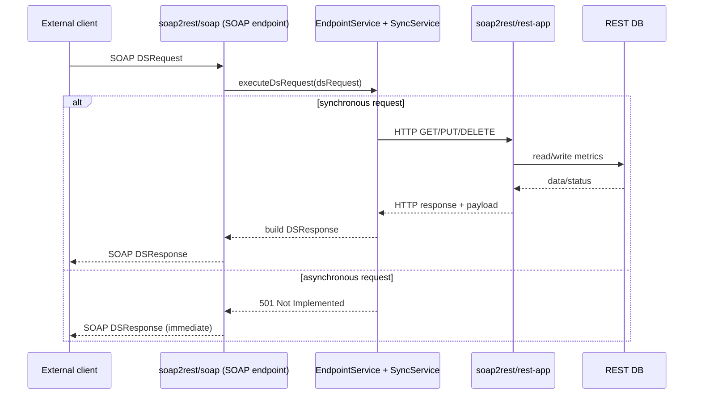

# Soap2Rest SOAP Module

This module exposes a SOAP endpoint and translates SOAP service orders into REST calls to `soap2rest/rest-app`.

## Contents

- [What this module does](#what-this-module-does)
- [Strangler pattern role](#strangler-pattern-role)
- [Current status](#current-status)
- [Request flow](#request-flow)
- [Endpoints and ports](#endpoints-and-ports)
- [WSDL and generated Java classes](#wsdl-and-generated-java-classes)
- [How to run](#how-to-run)
- [How to test](#how-to-test)
- [Test architecture (Cucumber)](#test-architecture-cucumber)
- [Expected output](#expected-output)
- [IDE troubleshooting](#idea-troubleshooting)
- [SoapUI](#soapui)

## What this module does

- Accepts SOAP `DSRequest` payloads in `DSEndpoint`.
- Routes request processing via `EndpointService`.
- Converts SOAP operation intent (`GET`, `PUT`, `DELETE`) to REST calls via `OrderService` implementations:
  - `ElectricService`
  - `GasService`
  - `SmartService`
- Maps REST responses back into SOAP `DSResponse`.

## Strangler pattern role

This module acts as a Strangler application pattern facade:

- External clients keep using the existing SOAP contract.
- Internally, business operations are delegated to the REST application.
- This enables gradual migration from SOAP integration to REST-based backend behavior without breaking existing SOAP clients.

## Current status

- Synchronous processing is implemented for electric, gas, and smart service orders.
- Asynchronous processing is not implemented yet.
- If `asyncronousResponse=true`, the service currently returns:
  - code: `501`
  - description: `Async Service is not implemented yet!`

## Request flow



## Endpoints and ports

- SOAP app default port: `8078`
- SOAP base path: `/soap2rest/soap/v1/*`
- WSDL URL: `http://localhost:8078/soap2rest/soap/v1/DeliverServiceWS.wsdl`
- Target REST app (configured): `http://localhost:8081`
- Auth header used for REST calls: `X-API-KEY`

## WSDL and generated Java classes

- WSDL source file: `src/main/resources/wsdl/ds.wsdl`
- Generated package: `my.javacraft.soap2rest.soap.generated.ds.ws`
- Generated output directory: `target/generated-sources`
- Generation plugin: `com.sun.xml.ws:jaxws-maven-plugin` (`wsimport` goal)

Generate sources explicitly:

```bash
mvn -pl soap2rest/soap generate-sources
```

or as part of compile/tests:

```bash
mvn -pl soap2rest/soap test-compile
```

## How to run

Run REST app first (for end-to-end/manual checks):

```bash
mvn -pl soap2rest/rest/rest-app spring-boot:run
```

Run SOAP app:

```bash
mvn -pl soap2rest/soap spring-boot:run
```

## How to test

Run all SOAP module tests:

```bash
mvn -pl soap2rest/soap test
```

Run only Cucumber scenarios:

```bash
mvn -pl soap2rest/soap -Dtest=my.javacraft.soap2rest.soap.cucumber.CucumberRunner test
```

## Test architecture (Cucumber)

- Runner: `CucumberRunner`
- Spring test context: `CucumberSpringConfiguration`
- Step definitions:
  - `WireMockDefinition`
  - `ElectricServiceDefinition`
  - `GasServiceDefinition`
  - `SmartServiceDefinition`
- Feature files:
  - `src/test/resources/features/ElectricService.feature`
  - `src/test/resources/features/GasService.feature`
  - `src/test/resources/features/SmartService.feature`

All REST HTTP calls in Cucumber tests are mocked with WireMock stubs from `WireMockDefinition`.

## Expected output

Successful test run prints:

```text
Tests run: <n>, Failures: 0, Errors: 0, Skipped: 0
BUILD SUCCESS
```

## IDEA troubleshooting

If a feature file is not linked to step definitions in IntelliJ:  https://youtrack.jetbrains.com/projects/IDEA/issues/IDEA-362929/Cucumber-feature-file-step-appears-as-undefined-in-IntelliJ-despite-the-test-running-successfully.

To fix it: install 'Cucumber Search Indexer' and 'Cucumber for Java' plugins

## SoapUI

This module contains a `SoapUI` directory with a project for manual SOAP request testing.

Website: https://www.soapui.org/
