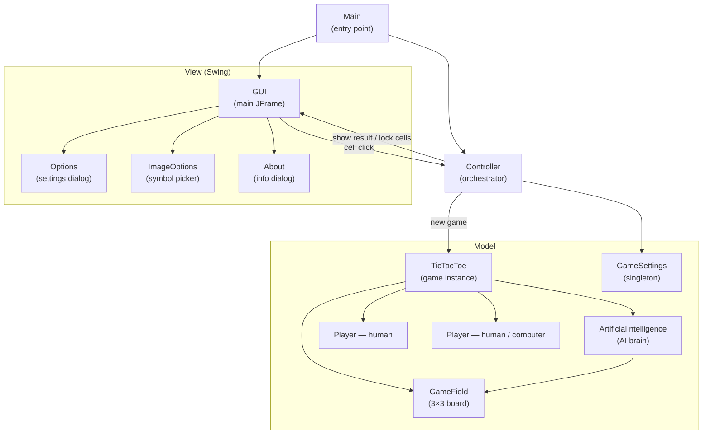
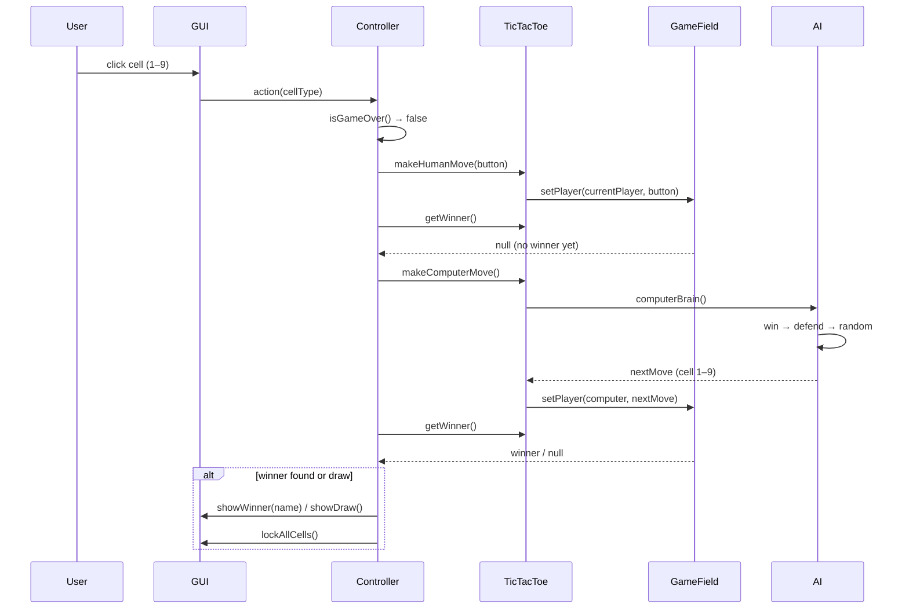

# Tic-Tac-Toe

A two-player Tic-Tac-Toe desktop game with a Swing GUI, a configurable AI opponent,
and customisable player symbols.

**Stack:** Java, Swing

## Contents
1. [Quick Start](#1-quick-start)
2. [Architecture](#2-architecture)
3. [Game Flow](#3-game-flow)
4. [Components](#4-components)
5. [AI Strategy](#5-ai-strategy)
6. [Configuration](#6-configuration)
7. [Image Customisation](#7-image-customisation)
8. [Tests](#8-tests)

---

## 1. Quick Start

### Build and run

```bash
mvn -pl tic-tac-toe package
java -jar tic-tac-toe/target/tic-tac-toe.jar
```

---

## 2. Architecture
<sub>[Back to top](#tic-tac-toe)</sub>

MVC pattern: `Controller` mediates between the Swing view and the pure-Java model.
The model has zero Swing dependencies and is fully unit-testable.



---

## 3. Game Flow
<sub>[Back to top](#tic-tac-toe)</sub>



The board is a 3×3 array of `Player` references (null = empty). Cells are numbered
1–9 left-to-right, top-to-bottom. Win detection checks all 8 combinations (3 rows,
3 columns, 2 diagonals) using reference equality on `Player` instances.

---

## 4. Components
<sub>[Back to top](#tic-tac-toe)</sub>

### Model

| Class | Role |
|-------|------|
| `TicTacToe` | Game instance — wires together two `Player`s, the `GameField`, and the `AI`; exposes `makeHumanMove()` and `makeComputerMove()` |
| `GameField` | 3×3 `Player` array; `setPlayer(player, cell)` places a move, `getWinner()` checks all 8 winning lines |
| `ArtificialIntelligence` | Stateful AI brain — see [AI Strategy](#ai-strategy) |
| `Player` | Name + `isComputer` flag |
| `GameSettings` | Singleton — tracks whose turn it is, whether the second player is a computer, and whether the current game is odd-numbered (controls first-move alternation) |

### View

| Class | Role |
|-------|------|
| `GUI` | Main `JFrame` — 3×3 grid of `Cell` buttons, menu bar (New Game / Options / Image / About), win/draw dialogs |
| `Cell` | `JButton` subclass with `isAlreadyPressed` flag and a 1–9 `type` index |
| `Options` | Settings dialog — player names, human vs. computer toggle, first-move preference |
| `ImageOptions` | Symbol picker — 14 icon choices per player (see [Image Customisation](#image-customisation)) |
| `About` | Info dialog — game version (1.0.0) and JVM / OS details |

### Controller

| Class | Role |
|-------|------|
| `Controller` | Orchestrates the full game loop: validates move legality, calls model, checks result, triggers next computer move, relays outcome back to the view |
| `Main` | Entry point — creates `GUI` singleton and `Controller`, wires them together |

---

## 5. AI Strategy
<sub>[Back to top](#tic-tac-toe)</sub>

The AI evaluates three priorities in order each turn:

1. **Winning move** — if the computer can complete a three-in-a-row on this turn, it takes it.
2. **Defensive move** — if the human can complete a three-in-a-row on the next turn, it blocks it.
3. **Random move** — prefers the centre cell (5); if taken, picks a random valid empty cell.

For steps 1 and 2 the AI scans diagonals first, then columns, then rows. The first
incomplete two-in-a-line (two of the target player + one empty) wins the scan.

---

## 6. Configuration
<sub>[Back to top](#tic-tac-toe)</sub>

The **Options** dialog (menu → *Options*) controls three settings:

| Setting | Default | Options |
|---------|---------|---------|
| Player 1 name | `Player 1` | Any string |
| Player 2 name | `Player 2` | Any string |
| Second player type | Computer | Human / Computer |
| First move | Alternating | Always Player 1 / Always Player 2 / Alternating |

When **Alternating** is selected, `GameSettings.isOddGame` flips after each completed game
so the loser of the previous game goes first in the next.

---

## 7. Image Customisation
<sub>[Back to top](#tic-tac-toe)</sub>

The **Image** menu lets each player pick their symbol icon. 14 options are available:

| # | Image file |
|---|-----------|
| 0 | `DefaultCrossOne.png` / `DefaultNoughtOne.png` *(default)* |
| 1 | `DefaultCrossTwo.png` / `DefaultNoughtTwo.png` |
| 2 | `Browser-Chrome.png` |
| 3 | `Browser-Firefox.png` |
| 4 | `Browser-Opera.png` |
| 5 | `Finder.png` |
| 6 | `Globe.png` |
| 7 | `Limewire.png` |
| 8 | `Netscape.png` |
| 9 | `Radiation.png` |
| 10 | `Sun.png` |
| 11 | `Vista.png` |
| … | *(selection auto-updates the cell icons live)* |

All images live in `src/main/resources/img/` and are bundled inside the JAR.

---

## 8. Tests
<sub>[Back to top](#tic-tac-toe)</sub>

Run all tests:

```bash
mvn -pl tic-tac-toe test
```

### Coverage summary

| Module | Tests | Line coverage |
|--------|------:|--------------:|
| tic-tac-toe | 45 | 65.7% |

> [!TIP]
> Model and Controller packages are at 100 %. The overall figure is pulled down by Swing view classes (GUI, Cell, About, Options, ImageOptions) which cannot be exercised in a headless test environment.

