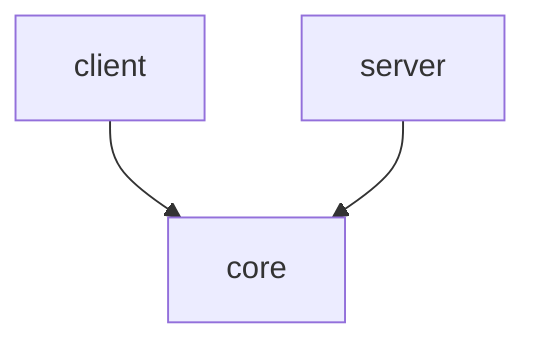
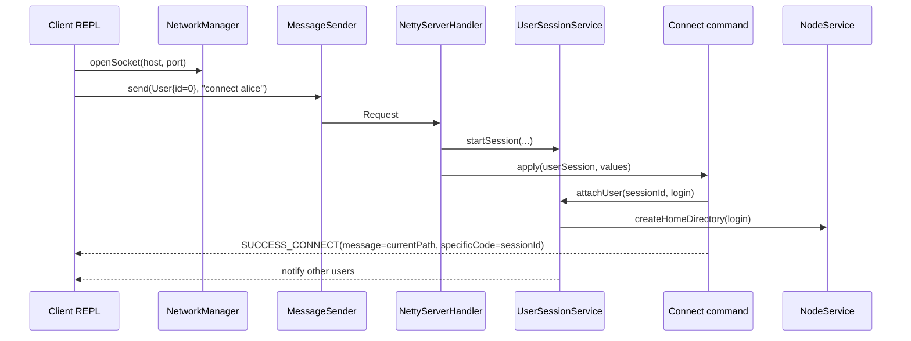
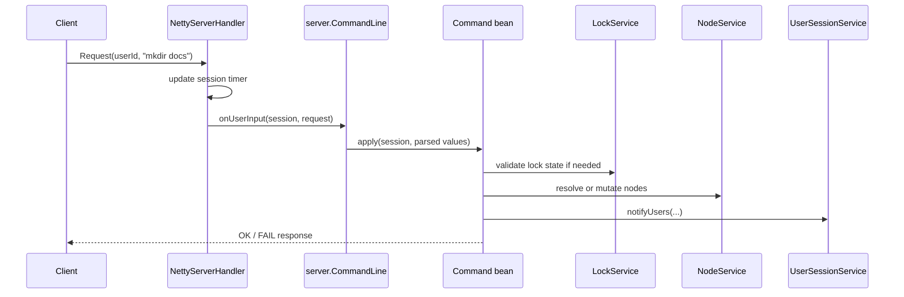

# VFS Architecture

<sub>[Back to VFS](README.md)</sub>

## Contents
1. [Goal](#1-goal)
2. [Module Map](#2-module-map)
3. [Runtime Topology](#3-runtime-topology)
4. [Command Flows](#4-command-flows)
5. [File System Model](#5-file-system-model)
6. [Locking And Session Model](#6-locking-and-session-model)
7. [Protocol And Framing](#7-protocol-and-framing)
8. [Testing Strategy](#8-testing-strategy)
9. [Current Tradeoffs](#9-current-tradeoffs)

## 1. Goal
<sub>[Back to top](#vfs-architecture)</sub>

`vfs` provides a shared, terminal-driven virtual file system.
Clients connect over TCP, send plain text commands wrapped in protobuf messages,
and operate on one server-owned in-memory directory tree.

The architecture is intentionally small:

- `vfs-core` owns the shared wire contract and command parsing
- `vfs-client` owns the interactive shell and network client
- `vfs-server` owns all mutable state: sessions, nodes, locks, and command execution

## 2. Module Map
<sub>[Back to top](#vfs-architecture)</sub>

| Module | Responsibility | Depends on |
| --- | --- | --- |
| `core` | protocol schema, generated protocol classes, command parser, factories, shared exceptions | none of the runtime modules |
| `client` | CLI loop, connect/disconnect behavior, Netty client pipeline, response printing | `core` |
| `server` | Netty server bootstrap, Spring command wiring, in-memory tree, sessions, locks, timeout cleanup | `core` |



Boundary rule:

- shared protocol and parsing belong in `core`
- client code must not know server internals
- server owns all stateful business behavior

## 3. Runtime Topology

```mermaid
flowchart TD
    subgraph client["vfs-client"]
        app["Application / Client"]
        cli["client.CommandLine"]
        nm["NetworkManager"]
        sender["MessageSender"]
        nc["NettyClient"]
        nch["NettyClientHandler"]
    end

    subgraph core["vfs-core"]
        proto["protocol.proto"]
        parser["CommandParser / CommandValues"]
        factories["RequestFactory / ResponseFactory"]
    end

    subgraph server["vfs-server"]
        boot["Application / Server"]
        init["NettyServerInitializer"]
        sh["NettyServerHandler"]
        scl["server.CommandLine"]
        cmds["Command beans"]
        ns["NodeService / NodeManager"]
        ls["LockService"]
        uss["UserSessionService"]
        timeout["TimeoutJob"]
        printer["NodePrinter"]
        tree[("In-memory node tree")]
        sessions[("Session registry")]
        locks[("Lock map")]
    end

    app --> cli
    cli --> nm
    cli --> sender
    nm --> nc
    nc --> nch

    parser --> cli
    parser --> scl
    factories --> sender
    proto --> factories

    boot --> init
    init --> sh
    sh --> scl
    scl --> cmds
    cmds --> ns
    cmds --> ls
    cmds --> uss
    cmds --> printer
    ns --> tree
    ls --> locks
    uss --> sessions
    timeout --> uss
```

<sub>[Back to top](#vfs-architecture)</sub>



Runtime notes:

- the server is a non-web Spring Boot application
- Netty handles transport; Spring wires the command and service graph
- the client is a plain Java REPL, not a Spring application
- every command is still sent as raw text; protobuf is used for transport framing and session identity

## 4. Command Flows
<sub>[Back to top](#vfs-architecture)</sub>

### Connect flow



Important details:

- the client initiates the handshake with `User{id="0"}`
- the server allocates the real session id
- the connect response carries both the assigned session id and the initial working directory

### Regular filesystem command flow



Error handling:

- parser or command-level failures are converted into `FAIL` responses
- `QuitException` is used as a control-flow signal to close the connection after `quit`

## 5. File System Model
<sub>[Back to top](#vfs-architecture)</sub>

The server keeps one shared tree rooted at `/`.

Initial structure:

```text
/
└── home
```

Per-user home directories are created under `/home/<login>` on connect and removed on disconnect.

### Data ownership

| Class | Responsibility |
| --- | --- |
| `Node` | mutable tree node with `name`, `type`, `parent`, and child list |
| `NodeManager` | low-level parent/child mutation and sibling name uniqueness |
| `NodeService` | path traversal, node creation/removal, cloning, home directory lifecycle |
| `NodePrinter` | deterministic textual rendering of the tree |

### Path handling

`NodeService` owns path semantics:

- `/absolute/path`
- relative paths from the current session node
- `.` for current node
- `..` for parent
- duplicate separators normalized by `removeDoubleSeparators`

### Copy and move behavior

- `copy` performs a deep clone of the source subtree
- `move` re-parents the source node under a new directory
- `print` renders the current subtree, not always the global root

## 6. Locking And Session Model
<sub>[Back to top](#vfs-architecture)</sub>

### Locking

`LockService` stores `Map<Node, NodeLock>` in memory.

Each `NodeLock` wraps:

- the owning `User`
- a `ReentrantLock`

Behavior:

- locks can target a single node or a subtree via `-r`
- only the owning user can unlock a node
- disconnect cleanup calls `unlockAll(user)`
- restart clears all locks because the lock map is in memory

### Sessions

`UserSessionService` owns `Map<String, UserSession>` keyed by session UUID.

Each `UserSession` stores:

- protobuf `User`
- current directory `Node`
- `Timer`
- `ClientWriter`

### Timeout handling

`TimeoutJob` runs once per minute.

It removes:

- empty sessions after 1 minute
- logged-in sessions after `server.timeout` minutes of inactivity

Before removal it:

- sends `SUCCESS_QUIT` to the timed-out user
- notifies other users
- removes the home directory
- releases user-owned locks

## 7. Protocol And Framing
<sub>[Back to top](#vfs-architecture)</sub>

The protobuf schema is defined in `core/src/main/resources/protocol.proto`.
`vfs-core` generates Java classes during Maven `generate-sources`.

Shared wire types:

- `User`
- `Request`
- `Response`

Netty pipeline on both sides:

```text
ProtobufVarint32FrameDecoder
ProtobufDecoder
ProtobufVarint32LengthFieldPrepender
ProtobufEncoder
Business handler
```

The protocol is intentionally thin:

- commands remain plain text
- protobuf carries identity and structured response status
- no version negotiation or compatibility layer exists

## 8. Testing Strategy
<sub>[Back to top](#vfs-architecture)</sub>

Testing is split by module.

### Core

- parser behavior
- protocol request/response factories
- shared preconditions and exceptions

### Client

- REPL command dispatch
- message sending
- Netty client helpers and response handling

### Server

- node creation, traversal, deletion, and cloning
- lock semantics
- session registry behavior
- timeout cleanup

Most server tests exercise Spring-managed components with the `test` profile so the real Netty server does not auto-start.

## 9. Current Tradeoffs
<sub>[Back to top](#vfs-architecture)</sub>

- the entire filesystem is in memory, so all state is lost on restart
- the architecture is single-server only; locking is shared in one JVM, not distributed
- commands are plain strings, so validation remains partly string-based instead of fully typed
- the server starts Netty from the `Server` component constructor unless the `test` profile is active, which is simple but not the cleanest lifecycle boundary
- an `aspects` package exists, but node lifecycle interception is not the active mechanism today because `NodeManager` handles node registration/removal directly and the related annotations are commented out
